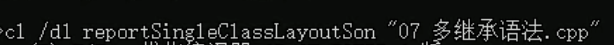
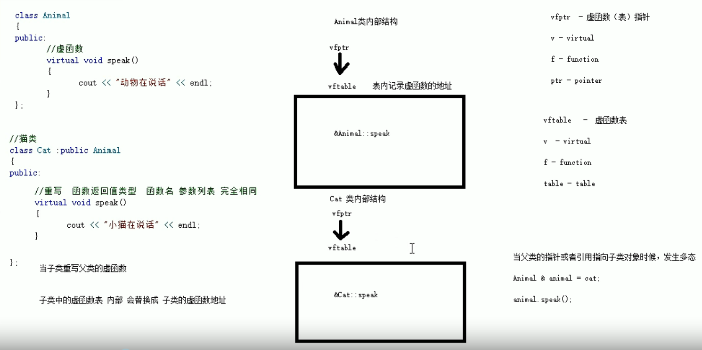

# C++基础

## 第一部分 基础入门

### 变量

### 标识符 

### 数据类型

### 运算符

### 程序流程结构

- 顺序结构

- 选择结构

- 循环结构

### 数组

### 函数

- 值传递和地址传递
- 分文件编写

### 指针

#### 指针占用内存空间

32位OS占4字节，64位OS占8字节

#### 空指针和野指针

#### const修饰指针

1. const修饰指针-常量指针

   `const int * p = &a;`

   指针的指向可以改，指针指向的值不可以改

2. const修饰常量-指针常量

   `int * const p = &a;`

   指针的指向不可以改，指针指向的值可以改

3. const即修饰指针，又修饰常量

   `const int * const p = &a;`

   指针的指向不可以改，指针指向的值不可以改

### 结构体

- 结构体数组

- 结构体指针

- 结构体嵌套结构体

- 结构体做函数参数

## 实例1 通讯录管理系统

[源代码](D:\0000\Cpp\CppBasic\Project1.cpp)

## 第二部分 核心编程

### 程序的内存模型

- 代码区
- 全局区
- 栈区
- 堆区

#### 程序运行前

编译后，产生可执行文件exe

**代码区：**

​	存放CPU执行的机器指令

​	**共享**的，**只读**的

**全局区：**

​	全局变量，静态变量

​	常量区 （字符串常量 全局常量）

​	*该区域的数据在程序结束后由操作系统释放*

#### 程序运行后

**栈区：**

​	编译器自动分配，存放函数参数值，局部变量等

​	注意：不要返回局部变量的地址

**堆区：**

​	程序员分配释放

​	C++中利用new

#### new关键字

用法

`int *p = new int(10);`
``delete p;``

```c++
int *arr = new int[10];//数组
delete[] arr; 
```

### 引用

```c++
int a=10;
int &b=a;
```

1. 引用必须要初始化
2. 引用一旦初始化，就不能更改了

#### 引用做函数参数

1. 值传递

   ```c++
   void swap(int a,int b){
       int t=a;a=b;b=t;
   }
       swap(a,b);
   ```

2. 地址传递

   ```c++
   void swap(int *a,int *b){
       int t=*a; *a=*b; *b=t;
   }
   	swap(&a,&b);
   ```

3. 引用传递

   ```c++
   void swap(int &a,int &b){
       int t=a;a=b;b=t;
   }
   	swap(a,b);
   ```

#### 引用做函数返回值

1. 不要返回局部变量的引用

   ```c++
   int& test(){
   	int a =10;
   	return a;//非法操作
   }
   ```

2. 函数的调用可以作为左值

   ```c++
   int& test(){
   	static int a =10;
   	return a;
   }
   main(){
       int &ref=test();
       test()=1000;
   }
   ```

#### 引用的本质

引用的本质在C++中是一个指针常量

```c++
//自动转换为int* const ref = &a; 指针常量是指针指向不能改，也说明为什么引用不能改
int& ref = a;
ref = 20;//内部发现ref是引用，自动转换为*ref=20;
```

#### 常量引用

用来修饰形参，防止误操作

```c++
const int & ref = 10;
//编译器解释为int temp = 10;const int & ref = temp;
ref = 20;//非法操作
```

```C++
show value(const int &val){//const防止误操作
    val=1000;//错误
    cout<<"val="<<val<<end;
}
main(){
    int a=100;
    value(a);
}
```

### 函数提高

#### 函数默认参数

```C++
int func(int a,int b=20,int c=30){
    return a+b+c;
}
main(){
    func(10,10);
}
```

1. 如果某个位置参数有默认值，从这个位置往后都必须有默认值
2. 声明和实现只能有一个有默认参数

#### 函数占位参数

占位参数可以有默认参数

```C++
void func(int a, int = 10){
    cout<<"this is afunc"<<endl;
}
func(10,10);
```

#### 函数重载

- 同一个作用域下
- 函数名称相同
- 函数参数**类型不同**或者**个数不同**或者**顺序不同**

```c++
void func(){}
void func(int a){}
void func(double a){}
void func(double a,int b){}
void func(int a,double b){}
```

- 注意：函数的返回值不可以作为函数重载的条件

#### 函数重载_注意事项

1. 引用作为重载的条件

   ```c++
   void fun(int &a){}
   void fun(const int &a){}
   ```

2. 函数重载碰到默认参数

   ```C++
   void fun(int a,int b=10){}
   void fun(int a){}
   fun(10);//出现二义性
   ```

### 类和对象

#### 封装

##### 封装的意义

- 将属性和行为作为一个整体，表现生活中的事物
- 将属性和行为加以权限控制

```c++
class 类名{
    访问权限：属性/行为
};
```

**访问权限：**

1. public
2. protected
3. private

##### struct和class的区别

- struct默认访问权限是public
- class默认访问权限是private

##### 成员属性设置为私有

**好处：**

1. 可以自己控制读写权限
2. 对于写可以检测数据的有效性

#### 对象的初始化和清理

##### 构造函数和析构函数

**构造函数：**`类名(){}`

1. 没有返回值也不写void
2. 函数名称与类名相同
3. 构造函数可以有参数，可以重载
4. 程序在调用对象时自动调用构造

**析构函数：**`类名(){}`

1. 没有返回值也不写void
2. 函数名称与类名相同，前加~
3. 析构函数不可以有参数，不能重载
4. 程序在对象销毁前自动调用析构

##### 构造函数的分类及调用

两种分类方式：

​	按参数分为：有参构造和无参构造

​	按类型分为：普通构造和拷贝构造

三种调用方式：

1. 括号法

   ```C++
   Person p1;
   person p2(10);
   Person p3(p2);
   ```

2. 显示法

   ```C++
   Person p1;
   person p2=Person(10);
   Person p3=Person(p2);
   ```

3. 隐式转换法

   ```C++
   Perons p4=10;//相当于Person p4=Peron(10);
   Person p5=p4;
   ```

##### 拷贝构造函数的调用时机

- 使用一个已经创建完毕的对象来初始化一个新对象

- 值传递的方式给函数参数传值

  ```C++
  void doWork(person p){}
  ```

- 以值方式返回局部对象

##### 构造函数调用规则

- 如果用户定义有参构造函数，C++不再提供默认无参构造
- 如果用户定义拷贝构造函数，C++不提供其他构造函数

##### 深拷贝与浅拷贝

深拷贝：简单的赋值拷贝操作

浅拷贝：在堆区重新申请空间，进行拷贝操作

```C++
class Person{
    int *m_a;
    Person(int a){
    	m_a = new int(a);
    }
    //拷贝构造函数
    Person(const Person &p){
        //m_a=p.m_a; 编译器默认实现
        //深拷贝
        m_a = new int(p.m_a);
    }
    ~Person(){
        if(m_a != NULL){
            delete m_a;
            m_a=NULL;
        }
    }
};
Person p1(18);
Person p2(p1);
```

##### 初始化列表

`构造函数():属性1(值1),属性2(值2)...{}`

##### 类对象作为类成员

 当其他类的对象作为本类成员，先构造类对象，再构造自身，析构顺序相反

##### 静态成员

- 静态成员变量

  - 所有对象共享同一份数据

  - 在编译阶段分配内存

  - 类内声明，类外初始化
  - 可以通过对象访问，也可以通过类名访问

  `class Person{`

  `public:static int m_A;`

  `};`

  `int Person::m_A=0; ` 

  通过类名访问：`Person::m_A`

- 静态成员函数

  - 所有对象共享同一个函数

  - 静态成员函数只能访问静态成员变量

  1. 通过对象访问

  2. 通过类名访问

     `Person::func();`

#### C++对象模型和this指针

##### 成员变量和成员函数分开存储

空对象占用1字节

##### this指针

**this指针指向被调用成员函数所属的对象**

this指针的用途：

- 当形参和成员变量同名时，可用this指针来区分
- 在类的非静态成员函数中返回对象本身，可使用return *this

##### 空指针访问成员函数

空指针可以调用成员函数，要注意有没有用到this指针

加判断，增加健壮性

```C++
if(this==NULL)
    return;
```

##### const修饰成员函数

**常函数：**

`void fun() const;`

- 常函数内不可以修改成员属性

- 成员属性声明时加关键字mutable后，在常函数中也可以修改

  `mutable int m_B;`

**常对象：**

`const Person p;`

- 常对象只能调用常函数

#### 友元

```C++
class Building{
    friend void goodGay(Building &b);//全局函数做友元
    friend class GoodGay;//类做友元
    friend void GoodGay::visit();//成员函数做友元
    string m_Sit;
public:
    string m_Bed;
    Building();
};
class GoodGay{
public:
    GoodGay();
	void visit();
	Building* building;
};
void goodGay(Building &b){}
```

##### 全局函数做友元

`friend void goodGay(Building &b);`

##### 类做友元

`friend class GoodGay;`

##### 成员函数做友元

`friend void GoodGay::visit();`

#### 运算符重载

##### 加号运算符重载

```C++
class Person{
public:
    int m_A;
    int m_B;
    //通过成员函数重载+号
	Person operator+(Person &p){
    Person t;
    t.m_A=this->m_A+p.m_A;
    t.m_B=this->m_B+p.m_B;
    return t;
	}
};
Person p3=p1.operator+(p2);
Person p3=p1+p2;
//通过全局函数重载+号
Person operator+(Person &p1, Person &p2){
	Person t;
    t.m_A=p1.m_A+p.m_A;
	t.m_B=p1.m_B+p.m_B;
    return t;
}
Person p3=operator+(p1,p2);
Person p3=p1+p2;
```

##### 左移运算符重载

```C++ 
class Person{
    int m_A;
    int m_B;
    //利用友元函数访问私有成员
    friend ostream& operator<<(ostream &cout,Person &p);
};

//通过全局函数重载<<运算符
ostream& operator<<(ostream &cout,Person &p){
	cout<<"m_A="<<p.m_A<<" m_B="<<p.m_B<<endl;
	return cout;
}
void test(){
	Person p;
	p.m_A=10;p.m_B=10;
	cout<<p;
}
```

##### 递增运算符重载

```C++
class MyInteger{
    friend ostream& operator<<(ostream &cout,Person &p);
    int m_Num;
public:
    MyInteger(){
        m_num=0;
    }
    //重载前置++运算符 返回引用是为了对同一个数据进行递增
	MyInteger& operator++(){
		//先++，再返回 
		m_Num++;
		return *this;
	} 
	//重载后置++运算符 
	MyInteger operator++(int){//int占位运算符 
		//记录结果，递增，返回记录的结果
		MyInteger temp=*this;
		m_Num++; 
		return temp;
	}
}
//重载<<运算符 
ostream& operator<<(ostream & cout,MyInteger myint){
	cout<<myint.m_Num;
	return cout;
}
void test(){
	MyInteger myint;
	cout<<++(++myint)<<endl;
	cout<<myint<<endl;
    cout<<myint++<<endl;
    cout<<myint<<endl;
}
```

 ##### 赋值运算符重载

参考浅拷贝和深拷贝

```C++
Person& operator=(Person &p){
	//m_age=p.age; 编译器提供 
	if(m_age != NULL){
        delete m_age;
        m_age=NULL;
	}
	m_age=new int(*p.m_age);
	return *this; 
}
p3=p2=p1;
```

##### 关系运算符重载

```C++
bool operator==(Person &p){
	if(this->m_Name==p.m_Name && this->m_Age==p.m_Age)
	{
		return 1;
	}
	return 0;
}
```

##### 函数调用运算符重载

- 函数调用运算符()也可以重载
- 由于重载后使用的方式非常像函数的调用，因此称为仿函数
- 仿函数没有固定写法，非常灵活

```C++
class MyPrint{
public:
	//重载函数调用运算符 
	void operator()(string test){
		cout<<test<<endl; 
	}
};
class MyAdd{
public:
	int operator()(int n1,int n2){
		return n1+n2;
	}
};
void test1(){
	MyPrint myp;
	myp("hello world");
    MyAdd mya;
	int ret = mya(100,100);
	cout<<"ret="<<ret<<endl;
    
    //匿名函数对象
    cout<<MyAdd()(100,100)<<endl;
}
```

#### 继承

`class 子类:继承方式 父类{}`

##### 继承方式 

- 公共继承
- 保护继承
- 私有继承

##### 继承中的对象模型

 ```C++
class Base{
public:
    int m_A;
protected:
    int m_B;
private:
    int m_C;
};
class Son:public Base{
    int m_D;
}
则sizeof(Son)=16 
 ```

VS提供的工具 开发人员命令提示符



##### 继承中的构造和析构顺序

##### 继承同名成员处理方式

- 访问子类同名成员 直接访问

- 访问父类同名成员 作用域

  `s.Base::m_A`

  `s.Base::func()`

1. 子类对象可以直接访问到子类中同名成员
2. 子类对象加作用域可以访问到父类同名成员
3. 当子类与父类拥有同名成员函数，子类会隐藏父类中同名成员函数，加作用域访问父类同名函数

##### 继承同名静态成员处理方式

静态成员和非静态成员出现重名，处理方式一致

1. 通过对象访问

2. 通过类名访问

   `Son::m_A`

   `Son::Base::m_A`

   `Son::func()`

   `Son::Base::func()`


##### 多继承

`class 子类:继承方式 父类1,继承方式 父类2...{}`

##### 菱形继承/钻石继承

利用**虚继承**解决菱形继承的问题

```C++
class Animal{//虚基类
public:
    int m_Age;
};
class Sheep:virtual public Animal{};
class Tuo:virtual public Animal{};
class SheepTuo:public Sheep,public Tuo{};

void test1(){
	SheepTuo st;
	st.m_Age=18;
}
```

#### 多态

多态分为两类：

- 静态多态：函数重载和运算符重载-编译时的多态
- 动态多态：派生类和虚函数-运行时的多态

动态编联满足条件：

1. 有继承关系
2. 子类重新父类的虚函数

动态多态使用

- 父类的指针或引用 指向子类对象

```c++
class Base{
    virtual void func(){}//虚函数
};
class Son:public Base{
    void func(){}
};
```

**虚函数**的作用是允许在派生类中重新定义与基类重名的函数，并且可以通过基类指针或引用来访问基类和派生类中的同名函数

##### 多态原理



##### 多态案例1-计算器

[源代码](D:\0000\Cpp\CppBasic\polymorphism1.cpp)

##### 纯虚函数和抽象类

`virtual 返回值类型 函数名 (参数列表) = 0;`

`virtual void func() = 0;`

只要有一个纯虚函数，这个类称为抽象类

抽象类特点：

1. 无法实例化对象
2. 抽象类的子类必须重写父类中的纯虚函数，否则也属于抽象类

```C++
class Base{
public:
	virtual void func()=0;
} ;

class Son :public Base{
	void func(){
		cout<<"test"<<endl;
	}
};
test1(){
	Base *base=new Son;
	base->func();
}
```

##### 多态案例2-制作饮品

[源代码](D:\0000\Cpp\CppBasic\polymorphism2.cpp)

##### 虚析构和纯虚析构

多态使用时，如果子类中有属性开辟到堆区，那么父类指针在释放时无法调用到子类的析构代码

虚析构和纯虚析构：

- 解决父类指针释放子类对象
- 都需要有具体的函数实现

`virtual ~类名(){}`

`virtual ~类名()=0;`

`类名::~类名(){}`

 利用虚析构可以解决父类指针释放子类对象时不干净的问题

总结：

1. 虚析构函数或纯虚析构是用来解决通过父类指针释放子类对象
2. 如果子类中没有堆区数据，可以不写为虚析构或纯虚虚构
3. 拥有纯虚析构函数的类也属于抽象类

多态案例3-电脑组装

[源代码](D:\0000\Cpp\CppBasic\polymorphism3.cpp)

### 文件操作

需要包含头文件`<fstream>`

文件类型分为：

1. 文本文件
2. 二进制文件

操作文件的三大类：

1. `ofstream`: 写操作
2. `ifstream`: 读操作
3. `fstream`: 读写操作

#### 文本文件

##### 写文件

1. 包含头文件

   `#include<fstream>`

2. 创建流对象

   `ofstream ofs;`

3. 打开文件

   `ofs.open("文件路径",打开方式);`

4. 写数据

   `ofs<<"写入的数据";`

5. 关闭文件

   `ofs.close();`

文件打开方式：

| 打开方式    | 解释                           |
| ----------- | ------------------------------ |
| ios::in     | 为读文件而打开文件             |
| ios::out    | 为写文件而打开文件             |
| ios::ate    | 初始位置：文件尾追加方式写文件 |
| ios::app    | 追加方式写文件                 |
| ios::trunc  | 如果文件存在先删除，再创建     |
| ios::binary | 二进制方式                     |

##### 读文件

1. 包含头文件

   `#include<fstream>`

2. 创建流对象

   `ifstream ifs;`

3. 打开文件，判断是否打开成功

   `ifs.open("文件路径",打开方式);`

4. 读数据

   四种方式读取

5. 关闭文件

   `ifs.close();`

```C++
void test1(){
    //2、创建流对象
	ifstream ifs;
    //3、打开文件，判断是否打开成功
	ifs.open("test.txt",ios::in);
	if(!ifs.is_open()){
		cout<<"文件打开失败！"<<endl;
		return;
	}
	//4、读数据 方式1 
	char buf[1024]={0};
	while(ifs >> buf){
		cout<<buf<<endl;
	} 
	//读数据方式2
	char buf[1024]={0};
	while(ifs.getline(buf,sizeof(buf))){
		cout<<buf<<endl;
	} 
	//读数据方式3
	string buf;
	while(getline(ifs,buf)){
		cout<<buf<<endl;
	}
	//读数据方式4 不推荐使用
	char c;
	while( (c=ifs.get())!=EOF ) {
		cout<<c;
	}
    //5、关闭文件
	ifs.close();
}
```

#### 二进制文件

打开方式指定为ios::binary

##### 写文件

调用流对象成员函数write	

函数原型：`ostream& write(const char *buffer,int len);`

```C++
void test1(){
    //2、3、建流对象，用构造函数打开文件
	ofstream ofs("person.txt",ios::out | ios::binary);
	Person p={"张三",18};
    //4、写文件
	ofs.write( (const char *)&p, sizeof(p));
    //5、关闭文件
	ofs.close();
}
```

##### 读文件

```C++
void test1(){
	ifstream ifs;
	ifs.open("person.txt",ios::in | ios::binary);
	if(!ifs.is_open()){
		cout<<"文件打开失败"<<endl; 
	}
	Person p;
	ifs.read((char *)&p,sizeof(p));
	cout<<p.m_Age<<p.m_Name<<endl;
	ifs.close();
}
```

## 实例2 员工管理系统

[源代码](D:\0000\Cpp\CppBasic\CppProject2)