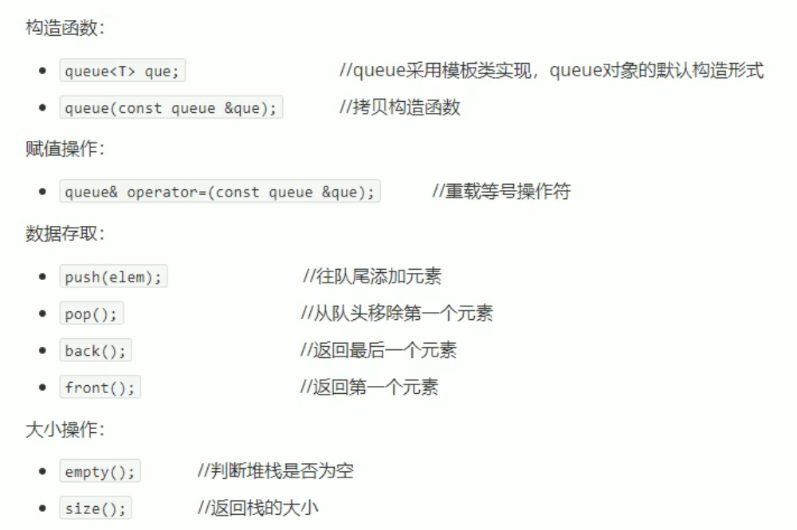

# C++提高

## 第三部分 提高编程

### 模板

- C++另一种编程思想称为泛型编程
- C++提供两种模板机制：函数模板和类模板

### 函数模板

建立一个通用函数，其函数返回值类型和形参类型可以不具体指定，用一个**虚拟的类型**来代表

#### 函数模板语法

```C++
template<typename T>
函数声明或定义
```

```C++
template<typename T>	//声明一个模板
void swap(T &a,T &b){
    T t=a;
    a=b;
    b=t;
}
//两种使用方式
int a=1,b=9;
//1、自动类型推导
Mswap(a,b);
//2、显示指定类型
Mswap<int>(a,b);
```

#### 函数模板注意事项

- 自动类型推导，必须导出一致的数据类型T，才可以使用
- 模板必须要确定出T的数据类型，才可以使用

```C++
template<class T>
void func(){
	cout<<"func"<<endl;
}
void test(){
	func();//错误，模板不能独立使用，必须确定T的类型 
	func<int>();//利用显示指定类型的方式，给T一个类型，才可以使用该模板 
}
```

#### 函数模板案例

- 利用函数模板封装一个排序算法，对**不同数据类型**数组进行排序

#### 普通函数和函数模板的区别

- 普通函数调用时可以发生自动类型转换（隐式类型转换）
- 函数模板调用时，如果利用自动类型推导，不会发生隐式类型转换
- 如果利用显示指定类型的方式，可以发生隐式类型转换

#### 普通函数和函数模板的调用规则

1. 如果函数模板和普通函数都可以实现，游戏调用普通函数

2. 可以通过空模板参数列表 强制调用函数模板

   `myPrint<>(a,b); `

3. 函数模板可以重载

4. 如果函数模板可以产生更好的匹配，有限调用函数模板

#### 模板的局限性

```C++
template<typename T>
bool myCompare(T &a,T &b){
    if(a==b)	return true;
}
Person p1,p2;
myCompare(p1,p2);//出错
//解决方法1、运算符重载
//解决方法2、重载模板

//利用具体化Person的版本实现代码，具体化优先调用
template<> bool myCompare(Person &p1,Person &p2){
    if(p1.name==p2.name&&p1.age==p2.age)
        return true;
}
```

- 学习模板不是为了写模板，而是在STL中能运用系统提供的模板

### 类模板

#### 类模板语法

```C++
template<class T>
类
```

```C++
template<class NameType,class AgeType>
class Person{
public:
	NameType m_Name;
	AgeType m_Age;
	
	Person(NameType name,AgeType age){
		m_Name=name;
		m_Age=age;
	}
	void showPerson(){
		cout<<"name:"<<m_Name<<" age:"<<m_Age<<endl;
	}
};
void test(){
	Person<string,int> p1("孙悟空",999);	
	p1.showPerson();
}
```

#### 类模板与函数模板的区别

1. 类模板没有自动类型推导的使用方式
2. 类模板在模板参数列表中可以有默认参数

```C++
template<class NameType,class AgeType=int>//默认参数
class Person{
public:
	NameType m_Name;
	AgeType m_Age;
	Person(NameType name,AgeType age){
		m_Name  =name;
		m_Age=age;
	} 
};
void test(){
	//Person p("孙悟空",1000);//错误，无法自动类型推导
	 Person<string> p("sun",1000);//正确 
}
```

#### 类模板中成员函数创建时机

- 普通类中的成员函数一开始就可以创建
- 类模板中的成员函数在调用时才创建

#### 类模板对象做函数参数

类模板实例化出的对象，向函数传参的方式

1. 指定传入的类型	---直接显示对象的数据类型
2. 参数模板化			---将对象中的参数变为模板进行传递
3. 整个类模板化		---将这个对象类型模板化进行传递

```C++
template<class T1, class T2>
class Person {
public:
	Person(T1 name, T2 age) {
		m_Name = name;
		m_Age = age;
	}
	void showPerson() {
		cout << "NAME is:" << m_Name << " Age IS:" << m_Age << endl;
	}
	T1 m_Name;
	T2 m_Age;
};

//1、指定传入类型 
void printPerson1(Person<string, int>& p) {
	p.showPerson();
}
void test1() {
	Person<string, int> p("lzq", 17);
	printPerson1(p);
}
//2、参数模板化
template<class T1, class T2>
void printPerson2(Person<T1, T2>& p) {
	p.showPerson();
}
void test2() {
	Person<string, int> p("lzq", 17);
	printPerson2(p);
}
//3、整个类模板化
template<class T>
void printPerson3(T &p) {
	p.showPerson();
}
void test3() {
	Person<string, int> p("lzq", 17);
	printPerson3(p);
}
```

#### 类模板与继承

```C++
template<class T>
class Base {
	T m;
};
class Son :public Base<int> {};//第一种继承方式
//如果想灵活指定父类中T类型，子类也需要变类模板
template<class T1,class T2>
class Son2 :public Base<T2>{
	T1 obj;
};
void test() {
	Son2<int, char>S2;
}
```

#### 类模板成员函数类外实现

```C++
template<class T1,class T2>
class Person {
public:
	Person(T1 name, T2 age); 
	void showPerson();
	T1 m_Name;
	T2 m_Age;
};
//构造函数类外实现
template<class T1,class T2>
Person<T1,T2>::Person(T1 name, T2 age) {
	m_Name = name;
	m_Age = age;
}
//成员函数的类外实现
template<class T1, class T2>
void Person<T1, T2>::showPerson() {
	cout << "NAME is:" << m_Name << " Age IS:" << m_Age << endl;
}
```

#### 类模板分文件编写

1. 第一种解决方式 直接包含源文件 .cpp
2. 第二种解决方式 将.h和.cpp中的内容写到一起，该后缀.hpp

#### 类模板和友元

全局函数类内实现-直接在类内声明友元即可

全局函数类外实现-需要让编译器提前知道全局函数的存在

```C++
//提前让编译器知道Person 类存在
template<class T1, class T2>
class Person;
//全局函数类外实现
template<class T1, class T2>
void printPerson2(Person<T1, T2> p) {
	cout << "类外实现 -- 姓名：" << p.m_Name << " 年龄：" << p.m_Age << endl;
}

template<class T1,class T2>
class Person {
	//全局函数类内实现
	friend void printPerson(Person<T1,T2> p) {
		cout << "类内实现 -- 姓名：" << p.m_Name << " 年龄：" << p.m_Age << endl;
	}
	//全局函数类外实现
	//加空模板参数列表
	//如果全局函数是类外实现，需要让编译器提前知道这个函数的存在
	friend void printPerson2<>(Person<T1, T2> p);
public:
	Person(T1 name, T2 age) {
		m_Name = name;
		m_Age = age;
	}
private:
	T1 m_Name;
	T2 m_Age;
};
```

#### 类模板案例

[源代码](D:\0000\Cpp\CppUp\TpProject)


### STL初识

C++的**面向对象**和**泛型编程**的思想，目的就是提升**复用性**

为了建立数据结构和算法的一套标准，诞生了**STL**

#### STL基本概念

- STL(Standard Template Library,标准模板库)
- STL从广义上分为：**容器(container)算法(algorithm)迭代器(iterator)**
- **容器**和**算法**之间通过**迭代器**进行无缝连接
- STL几乎所有的代码都采用了模板类或者模板函数

#### STL六大组件

1. 容器：各种数据结构
2. 算法：各种常用的算法
3. 迭代器：扮演了容器和算法之间的胶合剂
4. 仿函数：行为类似函数，可作为算法的某种策略
5. 适配器：一种用来修饰容器或者仿函数或迭代器接口的东西
6. 空间配置器：负责空间的配置与管理

#### 容器 算法 迭代器

容器：

​	序列式容器：强调值的排序，序列式容器中的每个元素均有固定的位置

​	关联式容器：二叉树结构，各元素之间没有严格的物理上的顺序关系

算法：

​	质变算法：运算过程中会改变区间内元素的内容，如拷贝、替换、删除

​	非质变算法：运算过程中不会改变区间内元素的内容，如查找、计数、遍历

迭代器：

提供一种方法，使之能够依序寻访某个容器所含的各个元素，而又无需暴露该容器的内部表达方式。

迭代器使用类似于指针

种类：输入迭代器、输出迭代器、前向迭代器、双向迭代器、随机访问迭代器

#### 容器算法迭代器初识

最常用的容器Vector，可以理解为数组

##### vector存放内置数据类型

容器：`vector`

算法：`for_each`

迭代器：`vector<int>::iterator`

```C++
#include<vector>	
	//vector存放内置数据类型	
	//创建一个vector容器 
	vector<int> v;

	//向容器中插入数据
	v.push_back(10);
	v.push_back(20);
	v.push_back(30);

	//通过迭代器访问
	vector<int>::iterator itBegin = v.begin(); // 起始迭代器 指向容器中第一个元素
	vector<int>::iterator itEnd = v.end();//结束迭代器 指向容器中最后一个元素的下一个位置

	//第一种遍历方式
	while (itBegin != itEnd) {
		cout << *itBegin << endl;
		itBegin++;
	}

	//第二种遍历方式	
	for (vector<int>::iterator it = v.begin(); it != v.end(); it++) {
		cout << *it << endl;
	}

	//第三种遍历方式 STL提供的遍历算法 包含头文件#include<algorithm>
	for_each(v.begin(), v.end(), myPrint);
```

##### vector存放自定义数据类型

```C++
//存放自定义数据类型
void test() {
	vector<Person>v;

	Person p1("ALIEN", 12);
	Person p2("Avvv", 15);
	Person p3("ddddd", 22);

	//向容器中添加数据
	v.push_back(p1);
	v.push_back(p2);
	v.push_back(p3);

	//遍历容器中的数据
	for (vector<Person>::iterator it = v.begin(); it != v.end(); it++) {
		//cout << "姓名：" << (*it).m_Name << "\t年龄：" << (*it).m_Age << endl;
		cout << "姓名：" << it->m_Name << "\t年龄：" << it->m_Age << endl;
	}
}

//存放自定义数据类型 指针
void test2() {
	vector<Person*>v;

	Person p1("ALIEN", 12);
	Person p2("Avvv", 15);
	Person p3("ddddd", 22);

	//向容器中添加数据
	v.push_back(&p1);
	v.push_back(&p2);
	v.push_back(&p3);

	//遍历容器中的数据
	for (vector<Person*>::iterator it = v.begin(); it != v.end(); it++) {
		cout << (*it)->m_Name << "\t" << (*it)->m_Age << endl;
	}
}
```

##### vector容器嵌套容器

```C++
//容器嵌套容器
void test() {
	vector<vector<int>> v;

	//创建小容器
	vector<int>v1;
	vector<int>v2;
	vector<int>v3;
	vector<int>v4;

	//向小容器中添加数据
	for (int i = 0; i < 4; i++) {
		v1.push_back(i+1);
		v2.push_back(i+2);
		v3.push_back(i+3);
		v4.push_back(i+4);
	}

	//将小容器插入到容器中
	v.push_back(v1);
	v.push_back(v2);
	v.push_back(v3);
	v.push_back(v4);

	//通过大容器，把所有数据遍历一遍
	for (vector<vector<int>>::iterator it = v.begin(); it != v.end(); it++) {
		//(*it)------容器verctor<int>
		for (vector<int>::iterator vit = (*it).begin(); vit != (*it).end(); vit++) {
			cout << *vit << " ";
		}
		cout << endl;
	}
}
```

### STL常用容器

#### string 容器

- string本质上是一个类

##### string构造函数

- `string();`	//创建一个空字符串，如：string str;

- `string(const char* s);`	//使用字符串s初始化

- `string(condt string& str);` //使用一个string对象初始化另一个string对象

- `string(int n,char c);` //使用n个字符c初始化

```C++
	string s1;

	const char* str = "hello wo";
	string s2(str);

	string s3(s2);

	string s4(10, 'a');
```

##### string赋值操作


```C++
	str1 = "helloWorld";
	str2 = str1;
	str3 = 'a';
	str4.assign("hello C++");
	str5.assign("hello C++",5);
	str6.assign(str5);
	str7.assign(10, 'w');
```

##### string字符串拼接


##### string查找和替换


##### string字符串比较

=返回0、>返回1、<返回-1


##### string字符存取


```C++
	string str = "hello";

	//通过[]访问单个字符
	for (int i = 0; i < str.size(); i++) {
		cout << str[i] << " ";
	}

	//通过at访问单个字符
	for (int i = 0; i < str.size(); i++) {
		cout << str.at(i)<< " ";
	}

	//	修改
	str[0] = 'x';
	str.at(3) = 'v';
```

##### string插入或删除


##### string子串


```C++
//实用操作
void test() {
	//从邮件地址中获取用户名信息
	string email = "zhangsan@123.com";
	int pos = email.find("@");

	string uName = email.substr(0, pos);
}
```

#### vector 容器

##### vector基本概念

- vector和数组非常相似，也称为**单端数组**

- 不同之处在于数组是静态空间，vector可以**动态扩展**

**动态扩展：**

- 并不是在原空间之后续接新空间，而是找更大的内存空间
- vector容器的迭代器是支持随机访问的迭代器

##### vector构造函数

- `vector<t> v;`  //采用模板实现类实现，默认构造函数

- `vector(v.begin(),v.end());` //将v[begin(),end())区间中的元素拷贝给本身

- ` vector(n,elem);` //构造函数将n个elem拷贝给本身

- `vector(const vector &vec);` //拷贝构造函数函数

```C++
	//默认构造
	vector<int>v1;
	for (int i = 0; i < 10; i++) {
		v1.push_back(i);
	}

	//通过区间方式进行构造
	vector<int>v2(v1.begin(), v1.end());

	//n个elem方式构造
	vector<int>v3(5, 13);

	//拷贝构造
	vector<int>v4(v3);
```

##### vector赋值操作


##### vector容量和大小


##### vector插入和删除


  ##### vector数据存取


```C++
	//利用[]方式访问数组中元素
	for (int i = 0; i < v1.size(); i++) {
		cout << v1[i] << " ";
	}

	//利用at方式访问数组中元素
	for (int i = 0; i < v1.size(); i++) {
		cout << v1.at(i) << " ";
	}
	//第一个元素
	cout << v1.front() << endl;
	//最后一个元素
	cout << v1.back() << endl;
```

##### vector互换容器

- `swap(vec);` //将vec与本身的元素互换

```C++
v1.swap(v2);

	//实际用途
	vector<int> v;
	for (int i = 0; i < 10000; i++) {
		v.push_back(i);
	}
	cout << "v的容量：" << v.capacity() << endl;
	cout << "v的大小：" << v.size() << endl;

	//重新指定大小
	v.resize(3);
	cout << "v的容量：" << v.capacity() << endl;
	cout << "v的大小：" << v.size() << endl;

	//巧用swap可以收缩内存空间
	vector<int>(v).swap(v);//vector<int>(v)是匿名对象
	cout << "v的容量：" << v.capacity() << endl;
	cout << "v的大小：" << v.size() << endl;
```

##### vector预留空间

- `reserve(int len);` //容器预留len个元素长度，预留位置不初始化，元素不可访问

```C++
	vector<int> v;
	//利用reserve预留空间
	v.reserve(10000);

	int num = 0;
	int* p = NULL;
	for (int i = 0; i < 10000; i++) {
		v.push_back(i);
		if (p != &v[0]) {
			p = &v[0];
			num++;//如果不预留，10000数据要开辟24次空间
		}
	}
	cout << num << endl;
```

#### deque 容器

- 双端数组

##### deque构造函数

- `deque<T> deqT` //默认构造函数

- `deque(beg,end);` //构造函数将[beg,end)区间中的元素拷贝给本身

- `deque(n,elem);` //构造函数将n个elem拷贝给本身
- `deque(const deque &deq);` //拷贝构造函数

```C++
//扩展： 只读迭代器
void printDeque(const deque<int>& d) {
	for (deque<int>::const_iterator it = d.begin(); it != d.end(); it++) {
		//*it = 100; 加const防止修改
		cout << *it << " ";
	}
	cout << endl;
}
```

##### deque赋值操作


##### deque大小操作


##### deque插入和删除


- 插入和删除的位置是迭代器

##### deque数据存取


##### deque排序

算法 包含`#include<algorithm>` 默认升序

- `sort(iterator beg,iterator end);` //对beg和end区间内元素进行排序

#### STL案例1-评委打分

[源代码](D:\0000\Cpp\CppUp\STL1.cpp)

#### stack 容器

##### stack基本概念

先进后出（没错，就是你想的那个栈）

不允许有遍历行为

##### stack常用接口


#### queue 容器

##### queue基本概念

先进先出 

只有队头和队尾能被外界访问，因此不允许有遍历行为

##### queue常用接口



#### list 容器

##### list基本概念

功能：链式存储

STL中的链表是一个双向循环链表

实际中**vector和list**是最常用的两个容器

##### list构造函数

- `list<T> lst;` //list采用模板类实现，对象的默认构造
- `list(beg,end);` //构造函数将[beg,end)区间中的元素拷贝给本身
- `list(n,elem);` //构造函数将n个elem拷贝给本身
- `list(const list &lst);` //拷贝构造函数

##### list赋值和交换


##### list大小操作


##### list插入和删除


##### list数据存取

不支持随机访问

- `front();` //返回第一个元素
- `back();` //返回最后一个元素

```C++
//验证迭代器是不支持随机访问
list<int>::iterator it=L.begin();
it++;//支持双向访问 it--;
//it=it+3;//不支持随机访问
```

##### list反转和排序

- `reverse();` //反转链表
- `sort();` //链表排序

```C++
//所有不支持随机访问迭代器的容器，不可以使用标准算法
//sort(L1.begin(),L1.end());
//不支持随机访问迭代器的容器，内部会提供对应算法 (成员函数)
L1.sort();//默认升序
```

```C++
bool myCompare(int v1, int v2) {
	return v1 > v2;
}
L1.sort(myCompare);//降序
```

##### 排序案例

自定义Person类，按照年龄升序，如果年龄相同按照身高降序

[源代码](D:\0000\Cpp\CppUp\listSort.cpp)

```C++
//指定排序规则
bool comparePerson(Person &p1,Person &p2){
	//按照年龄 升序
	if (p1.m_Age == p2.m_Age) {
		//如果年龄相同，按身高 降序 
		return p1.m_height > p2.m_height;
	}
	return p1.m_Age < p2.m_Age;
}
```

#### set/multiset 容器

##### set基本概念

- 所有元素都会在插入时自动被排序
- set/multiset 属于**关联式容器**，底层结构是**二叉树**

set和multiset区别：

- set不允许容器中有重复的元素
- multiset允许容器中有重复的元素

##### set构造和赋值

- `set<T> st;` //默认构造函数
- `set(const srt &st);` //拷贝构造函数
- `set& operator=(const set &at);` //重载=运算符

 ##### set大小和交换

不支持resize

- `size();` //返回容器中元素的数目
- `empty();` //判断容器是否为空
- `swap(st);` //交换两个集合容器

##### set插入和删除


##### set查找和统计

- `find(key);` //查找key是否存在，若存在，返回该键的元素的迭代器；若不存在，返回set.end();

- `count(key);` //统计key的元素个数

  对于set而言，统计的结果不是0就是1

##### set和multiset区别

- set不可以插入重复数据，而multiset可以
- set插入数据的同时会返回插入结果，表示插入是否成功
- multiset不会检测数据，因此可以插入重复数据

```C++
	set<int> s;

	pair<set<int>::iterator, bool> ret = s.insert(20);
	if (ret.second) 
		cout << "插入成功" << endl;
	else
		cout << "插入失败" << endl;

	ret = s.insert(20);
	if (ret.second)
		cout << "插入成功" << endl;
	else 
		cout << "插入失败" << endl;
```

##### pair对组创建

两种创建方式：

- `pair<type,type> p (value1,value2);`
- `pair<type,type> p = make_pair(value1,value2);`

使用 `p.first`   `p.second`访问

##### set容器排序

- 默认升序
- 利用仿函数，改变排序规则

示例一 set存放默认数据类型

```C++
class MyCompare {
public:
	bool operator()(int v1,int v2) const {//VS2019要加const
		return v1 > v2;
	}
};
set<int, MyCompare>s2;
```

示例一 set存放自定义数据类型

```C++
class Person{string m_Name;int m_Age};
class comparePerson {
public:
	bool operator()(const Person &p1, const Person& p2)const{
		//按照年龄降序
		return p1.m_Age > p2.m_Age;
	}
};
	set<Person,comparePerson>s;
```

#### map/multimap容器

##### map基本概念

- map中所有元素都是pair
- pair中第一个元素为key（键值），起到索引作用，第二个元素为value
- 所有元素都会根据元素的键值自动排序
- 本质：map/multimap属于关联式容器，底层结构是用二叉树实现

map/multimap区别：

- map不允许容器中有重复key值
- multimap允许容器中有重复key值

##### map构造和赋值

- `map<T1,T2> mp;` //map默认构造函数
- `map(const map &mp);` //拷贝构造函数
- `map& operator=(const map &mp);` //重载=运算符

##### map大小和交换

- `size();`
- `empty();`
- `swap(st);`

##### map插入和删除


```c++
map<int, int>m;

m.insert(pair<int, int>(1, 10));
m.insert(make_pair(2, 20));
m.insert(map<int, int>::value_type(3, 30));
m[4] = 40;//不建议插入数据 用途：利用key访问value
```

##### map查找和统计

- `find(key);` //返回的是迭代器

- `count(key);`

  对于map而言，统计的结果不是0就是1

##### map容器排序

- 利用仿函数，改变排序规则

```C++
class mcompare {
public:
	bool operator()(int v1, int v2) const{
		return v1 > v2;
	}
};
	map<int, int,mcompare> m;
```

#### STL案例2-员工分组

[源代码](D:\0000\Cpp\CppUp\STL2.cpp)

### STL函数对象

#### 函数对象

##### 函数对象概念

- 重载**函数调用操作符**的类，其对象称为**函数对象**
- **函数对象**使用重载的()时，行为类似函数调用，也叫**仿函数**

**本质：**函数对象(仿函数)是一个**类**，不是一个函数

##### 函数对象使用

**特点：**

- 函数对象在使用时，可以像普通函数样调用，可以有参数，可以有返回值
- 函数对象超出普通函数的概念，函数对象可以有自己的状态
- 函数对象可以作为参数传递

```C++
class MyAdd {
public:
	int operator()(int v1, int v2) {
		return v1 + v2;
	}
};
//函数对象在使用时，可以像普通函数样调用，可以有参数，可以有返回值
void test1() {
	MyAdd myAdd;
	cout << myAdd(10, 10);
}

class MyPrint {
public:
	MyPrint() {
		count = 0;
    }
	void operator()(string test) {
		cout << test << endl;
		count++;
	}
	int count;
};
//函数对象超出普通函数的概念，函数对象可以有自己的状态
void test2() {
	MyPrint myPrint;
	myPrint("Helloworld");
	myPrint("Helloworld");
	myPrint("Helloworld");
	myPrint("Helloworld");
	cout << "MyPrint调用次数：" << myPrint.count << endl;
}

void doPrint(MyPrint& mp, string test) {
	mp(test);
}
//函数对象可以作为参数传递
void test3(){
	MyPrint myPrint;
	doPrint(myPrint, "helloC++");
}
```

#### 谓词

- 返回bool类型的仿函数称为谓词
- 如果operator()接受一个参数，那么叫做一元谓词
- 如果operator()接受两个参数，那么叫做二元谓词

##### 一 元 谓 词

```C++
class GreaterFive {
public:
	bool operator()(int val) {
		return val > 5;
	}
};
void test1() {
    vector<int> v;
	for (int i = 0; i < 10; i++) {
		v.push_back(i);
	}
	//查找容器中有没有大于5的数字
	//GreaterFive()匿名函数对象
	vector<int>::iterator it=find_if(v.begin(), v.end(), GreaterFive());
	if (it == v.end()) 
		cout << "NOT FOund" << endl;
	else 
		cout << "FIND:" << *it << endl;
}
```

##### 二元谓词

```C++
class MyCompare {
public:
	bool operator()(int v1,int v2) {
		return v1 > v2;
	}
};
void test1() {
	vector<int>v;
	v.push_back(10);
	v.push_back(50);
	v.push_back(30);

	sort(v.begin(), v.end(), MyCompare());//降序排序
	for (vector<int>::iterator it = v.begin(); it != v.end(); it++) {
		cout << *it << " ";
	}
}
```

#### 内建函数对象

- 这些仿函数所产生的对象，用法和一般函数完全相同
- 使用内建函数对象，需要引入头文件`#include<functional>`

##### 算术仿函数

- 实现四则运算
- negate是一元运算，其他是二元运算


```C++
	negate<int> n;
	cout << n(50) << endl;
	plus<int> p;
	cout << p(10, 10) << endl;
```

##### 关系仿函数


```C++
	sort(v.begin(), v.end(),greater<int>());
```

##### 逻辑仿函数


```C++
//将v中数据搬运到v2中，并取反
transform(v.begin(), v.end(), v2.begin(),logical_not<bool>());
```

### STL常用算法

- 头文件`<algorithm>` `<functional>` `<numeric>`

- `<algorithm>`是所有STL头文件中最大的一个，范围涉及到比较、交换、查找、遍历操作、复制、修改等
- `<numeric>`体积很小，只包括几个在序列上面进行简单数学运算的模板函数
- `<functional>`定义了一些模板类，用以声明函数对象。

#### 常用遍历算法

##### for_each

- 实现遍历容器

- `for_each(iterator beg,iterator end,_func);`

```C++
//普通函数
void print01(int val) {
	cout << val << " ";
}
//仿函数
class print02 {
public:
	void operator()(int val) {
		cout << val << " ";
	}
};
for_each(v.begin(), v.end(), print01);//普通函数
for_each(v.begin(), v.end(), print02());//仿函数
```

##### transform

- 搬运容器到另一个容器中

- `transform(iterator beg1,iterator end1,iterator beg2,_func);`

```C++
class trans {
public:
	int operator()(int v) {
		return v+100;
	}
};
vTarget.resize(v.size());//目标容器要提前开辟空间
transform(v.begin(), v.end(), vTarget.begin(), trans());
```

#### 常用查找算法

##### find

- 查找指定元素，找到返回指定元素的迭代器，找不到返回结束迭代器end()

- `find(iterator beg,iterator end,value);`

```C++
//1、内置数据类型的查找
vector<int>::iterator it=find(v.begin(),v.end(),5);
//2、自定义数据类型
class Person {
public:
	string m_Name;
	int m_Age;
	//重载== 底层find知道如何对比
	bool operator==(const Person &p) {
		if (m_Name == p.m_Name && m_Age == p.m_Age) 
			return true;
		else 
			return false;
	}
};
	vector<Person>::iterator it = find(v.begin(), v.end(), p2);//Person p2
```

##### find_if

- 按条件查找元素

- `find_if(iterator beg,iterator end,_Pred);`

//1、内置数据类型的查找 [一元谓词](#一-元-谓-词) 

```C++
//2、自定义数据类型
class Greater20 {
public:
	bool operator()(Person &p) {
		return p.m_Age > 20;
	}
};
	vector<Person>::iterator it = find_if(v.begin(), v.end(), Greater20());
```

##### adjacent_find

- 查找相邻重复元素

- `adjacent_find(iterator beg,iterator end);`

##### binary_search

- `bool binary_search(iteratot beg,iterator end,value);`
- 查找指定的元素，查到返回true，否则返回false
- 在无序序列中不可用

##### count

- 统计元素个数
- `count(iterator beg,iterator end,value);`

```C++
//对于自定义数据类型
	//需要重载== 让底层知道如何对比
	bool operator==(const Person& p) {
		if (m_Age == p.m_Age) {
			return true;
		}
		return false;
	}
```

##### count_if

- 按条件统计元素个数
- `count_if(iterator beg,iterator end,_Pred);`

```C++
//内置数据类型
class greater2 {
public:
	bool operator()(int val){
		return val > 20;
	}
};
	int num = count_if(v.begin(), v.end(), greater2());
//自定义数据类型
class greater20 {
public:
	bool operator()(const Person& p) {
		return p.m_Age > 20;
	}
};
	int num = count_if(v.begin(), v.end(), greater20());
```

#### 常用排序算法

##### sort

- 对容器内元素进行排序
- `sort(iterator beg,iterator end,_Pred);`

```C++
//降序
sort(v.begin(), v.end(),greater<int>());
```

##### random_shuffle

- 洗牌
- `random_shuffle(iterator beg,iterator end);`

##### merge

- 容器元素，并存储到另一容器中
- `merge(iterator beg1,iterator end1,iterator beg2,iterator end2,iterator dest);`
- 需要两个有序序列，合并后依然有序

##### reverse

- 将容器内元素进行反转
- `reverse(iterator beg,iterator end);`

#### 常用拷贝和替换算法

##### copy

- 容器内指定范围的元素拷贝到另一容器中
- `copy(iterator beg,iterator end,iterator dest);`

##### replace

- 将容器内指定范围的旧元素改为新元素
- `replace(iterator beg,iterator enf,oldvalue,newvalue);`

##### replace_if

- 容器内指定范围满足条件的元素替换为新元素
- `replace_if(iterator beg,iterator end,_pred,newvalue);`

##### swap

- 互换两个容器的元素

- `swap(container c1,container c2);`

#### 常用算术生成算法

- 属于小型算法，包含头文件`#include<numeric>`

##### accumulate

- 计算区间内容器元素累计总和
- `accumulate(iterator beg,iterator end,value);`

```C++
//参数3是起始累加值，不需要就填0
int t = accumulate(v.begin(), v.end(), 0);
```

##### fill

- 向容器中填充指定的元素
- `fill(iterator beg,iterator end,value);`

#### 常用集合算法

##### set_intersection

- 求两个容器的交集

- `set_intersection(iterator beg1,iterator en1,iterator beg2,iterator end2,iterator dest);`

  //注意：**两个集合必须是有序序列**

  //返回目标容器的最后一个元素迭代器地址

##### set_union

- 求两个容器的并集

- `set_union(iterator beg1,iterator en1,iterator beg2,iterator end2,iterator dest);`

  //注意：**两个集合必须是有序序列**

##### set_difference

- 求两个容器的差集

- `set_difference(iterator beg1,iterator en1,iterator beg2,iterator end2,iterator dest);`

  //注意：**两个集合必须是有序序列**

