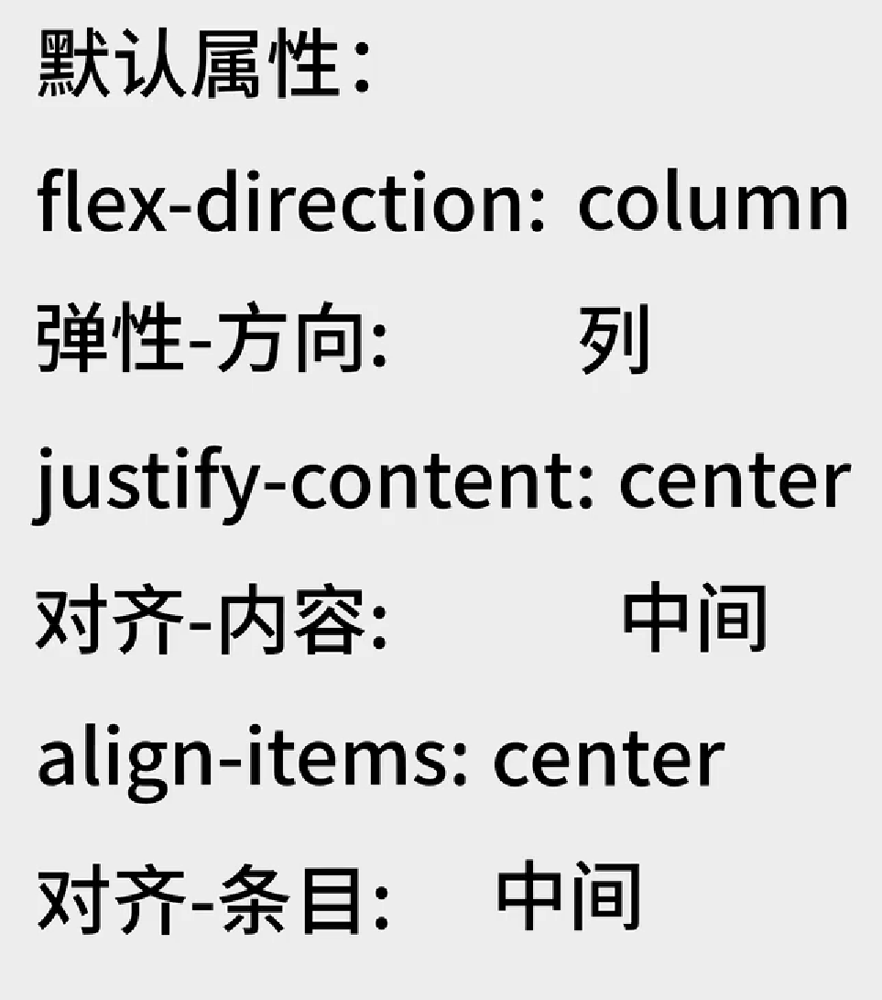
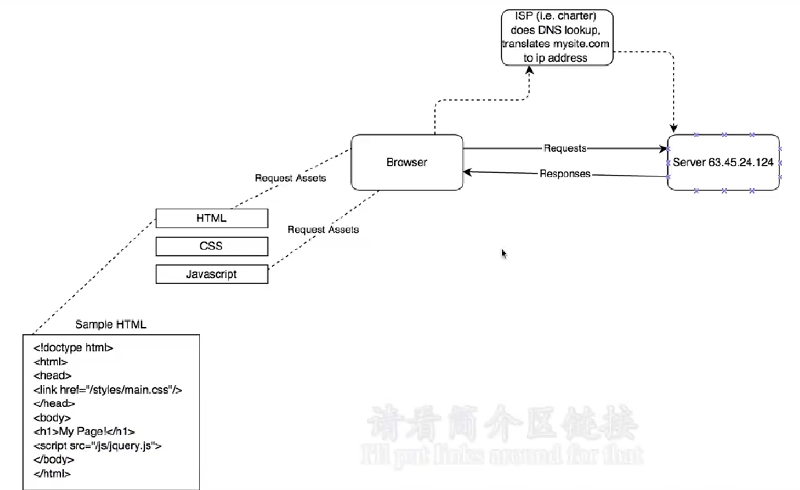
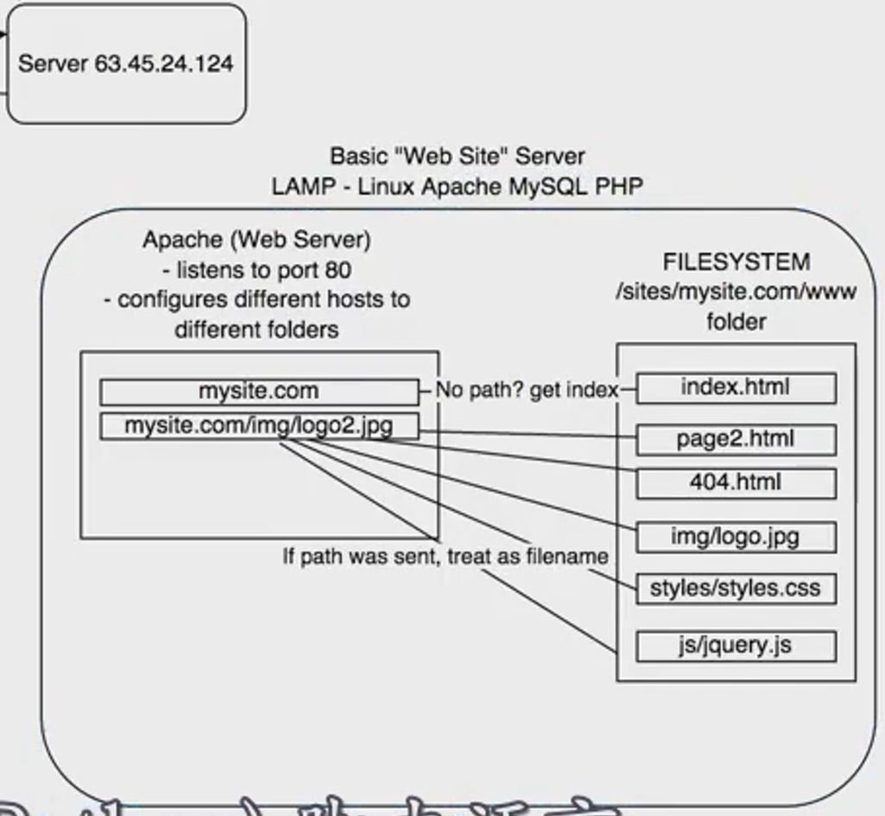
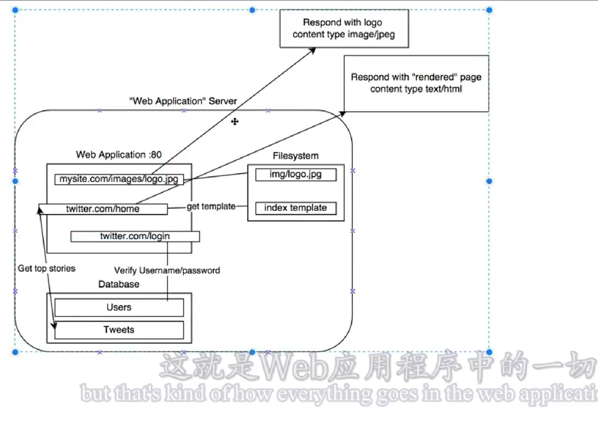

# html和CSS

## 常用标签

```html
<!DOCTYPE html>
<html lang="en">

<head>
    <meta charset="UTF-8">
    <meta http-equiv="X-UA-Compatible" content="IE=edge">
    <meta name="viewport" content="width=device-width, initial-scale=1.0">
    <title>MyPage</title>
    <link rel="stylesheet" type="text/css" href="1.css">

    <style>
        a {
            color: black;
        }
    </style>
</head>

<body style="margin: 0;">
    <div style="
        background-color: #f1f1f1;
        text-align: center;
        padding: 40px;
    ">
        
    </div>
    <div style="
      max-width: 760px;
      margin: 30px auto;
      padding: 15px;
      line-height: 1.7;
    ">
        <p class="text">坐看云起时；</p>
        <br>
        <a href="flex.html">Flex布局</a>
    </div>
    <div style="
        background-color: #f1f1f1;
        text-align: center;
        padding: 40px;
        font-size: 12px;
    ">
        <p id="one">版权所有:alien</p>
        <a href="https://alien-orbot.github.io/MyPage/">我的网站</a>
    </div>
</body>

</html>
```

## flex布局



[深度解析 CSS Flexbox 布局](https://juejin.cn/post/6844904116141948936)

# Javascript

## 基本语法

[Docs (feishu.cn)](https://metaisland.feishu.cn/mindnotes/bmncnVm87LbPlQF0jigDuSegubd#mindmap)

### 变量

在js中，一切都是对象object

- 7种原始值：string、number、boolean、null、undefined、bigint、symbol
- 函数function
- 数组array ["alien",123]
- 正则reg

```javascript
let x=3;
var y='alien';
```

alert()函数
prompt()函数

### if-else

### 函数

```javascript
function go(){
    alert('hi');
}
var myList = ['aple','orange','bananas',['alien','zhu'],go];
//JS中函数就是一种变量
```

js的数组可以包含不同类型；JS中函数就是一种变量

#### 箭头函数

- ()=>{} 忽略了function关键词

  - 如果不带{}相当于直接返回结果如：()=>jieGuo

  - 通常用let声明 let hanShu = ()=>{}

  - 没有this指向

  - https://juejin.cn/post/6844903805960585224

#### 异步函数

- 回调函数：function a(canShu){ return canShu(data)} ; a(function(shuJu){ console.log(“返回的数据”) })
- promise 函数
- async 函数

#### 类class

#### 内置函数

（常用的）

- 语言环境自带函数

  console.log()
  String()
  Boolean()
  Number()
  parselnt()
  parseFloat()
  encodeURl()
  decodeURl()

- 内置对象函数

  JSON对象
  Math数学对象
  Date日期对象
  Error错误对象

- 数据自带函数

  对象object
  string
  array

### 循环

while
do-while
for

## 常用DOM操作

```html
<!DOCTYPE html>
<html lang="en">
<head>...</head>
<body>
	<header>
		<h1>javascript Selectors</h1>
	</header>

	<main>
		<p>Paragraph</p>
		<p class="second">Paragraph .second</p>
		<h4>Lists</h4>
		<ul id="checklist">
			<li>apple</li>
			<li class="done">oranges</li>
			<li>bananans</li>
			<li>watermelons</li>
		</ul>
	</main>

</body>
</html>
```

```javascript
//document的一些玩法
var pTags = document.getElementsByTagName('p')
firstPTag = pTags[0]
document.getElementsByClassName('done')
document.getElementById('checklist')
document.querySelector('.done')
document.querySelector('#checklist')
document.querySelectorAll('p')

//改变HTML文档中的p
firstPTag.innerHTML="new paragraph <strong>content</strong>"
//操纵类
var li=document.querySelector('.done')
li.className="other"
li.className=li.className+"alien"
li.className=li.className.replace("other","done for")
li.classList
li.classList.add('new')
li.classList.remove('new')
li.parentElement
li.parentElement.parentElement
li.parentElement.children
li.parentElement.children[0].innerHTML="Frank"
```

网站[Can I use... Support tables for HTML5, CSS3, etc](https://caniuse.com/)可以看到要用的方法在各个浏览器的支持情况

## 常用事件

- Javascript Events:

  - click
  - mouseenter
  - mouseleave
  - mousedown
  - mouseup
  - mousemove
  - keydown
  - keyup
  - blur
  - focus

  [事件参考 | MDN (mozilla.org)](https://developer.mozilla.org/zh-CN/docs/Web/Events)

JS常用事件绑定、事件监听实战：
[JSEvents](D:\0000\Webs\JSEvents)

## jQuery

引用jQ库

<script src="jquery.js"></script>

### jQ事件监听

```javascript
$(function () {
	// 事件监听
	var content = "my new content";
	$('.panel-button').on('click', function () {
		var panelId = $(this).attr('data-panelid');
        $('#' + panelId).toggle();
        $('#' + panelId + ' .panel-body').html(content);
	});
});
```

### jQ-DOM实操

```javascript
$(function () {
	$('li').on('click', function () {
		$(this).removeClass('special');
		$(this).siblings().addClass('special');
		$(this).parents().addClass('special');
		$(this).closest('.list').addClass('special');
		})

    // filter
	$('.list').on('click', function () {
		$(this).find('li').filter(':first').addClass('special');
        $(this).find('li').filter('.special').remove(); 						//$(this).find('.special').remove();
    })

	// if语句
	$('li').on('click', function () {
		$(this).hide()
		if ($(this).is('.special')) {
			alert("special")
		}
	});

	$('li').on('click', function () {
		console.log("clicked li")
        if ($(this).parent().is('.sublist')) {
			$(this).hide();
        }
    });
});
```

### 基于AJAX向后端发起请求

#### GET请求

#### POST请求

#### DELETE请求

#### PUT请求

## 网络工作原理

### 基于前端的网络工作原理



### 基于后端的网络工作原理






## JS进阶

### 头等函数

```javascript
function add(first,second,callback){
    console.log(first+second);
    if(callback){
        callback();
    }
}
function logDone(){
    console.log('done');
}
add(2,3,logDone);
add(2,3);
function handleClick(){
    //something smart
}
$('#myDiv').click();
```

### 事件驱动

```javascript
$(document).ready(function(){
    $('button').on('click',function(){
        alert("yay!");
    });
});
```

