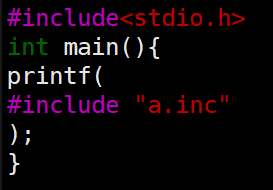
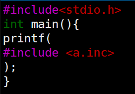

# C语言拾遗

## 机制

IDE里如何编译运行？

- 编译、链接
  - .c → 预编译 → .i → 编译 → .s → 汇编 → .o → 链接 → a.out
- 加载执行
  - ./a.out

调用命令行工具

- RTFM: gcc --help; man gcc; tldr gcc
  - -E, -S, -c

### 概述

gcc后vi a.out，编辑模式下:!%xxd，转换为十六进制形式

（另外，可以file a.out辨识文件类型）


gcc -E


gcc -S 得到a.s


查看a.s


gcc -c 得到a.o


objdump -d a.o
(objdump是用来查看二进制文件的反汇编)


### 预编译	

#### #include<>指令

学会阅读命令的日志 --verbose
gcc a.c --verbose


include<>和include""



include<>会报错。gcc a.c -I.将当前目录添加到系统目录，则可以用<>。

查看gcc a.c -I --verbose多了一行


#### 有趣的预编译

```c
#include<stdio.h>
int main(){
#if aa == bb
    printf("Yes\n");
#else
    printf("No\n");
#endif
}
```


输出什么？为什么？
Yes
所有的东西都是字符串的替换。C所有预编译的变量不需要定义就可以使用
即 空==空

#### 宏定义与展开

宏展开：通过**复制/粘贴**改变代码的形态

- #include → 粘贴文件
- aa,bb → 粘贴符号

#和##

#### X-Macros

- 反复粘贴，直到没有宏可以展开为止

#### 有趣的预编译

- 也称为元编程（meta-programming）
  - gcc的预处理器同样可以处理汇编代码
  - C++中的模板元编程；Rust的macros；...

### 编译与链接

#### 编译

- **C代码的连续一段**总能找到对应的**一段连续的机器指令**
  - 这就是为什么大家会觉得C是高级的汇编语言！

```C
//a.c
int foo(int n){
    int sum = 0;
    for(int i = 1; i <= n; i++){
        sum +=i;
    }
    return sum;
}
```

gcc -S a.c  分析a.s汇编代码


gcc -c a.c 
objdump -d a.o 分析a.o机器代码


```c
//b.c
int foo(int);
int main(){
	printf("%d\n", foo(100));
}
```

gcc -c b.c
gcc a.o b.o -static 链接a.o和b.o
objdump -d a.out 

#### 链接

将多个二进制目标代码拼接在一起

- C中称为编译单元（complication unit）
- 甚至可以链接C++, rust, ...代码

```c++
//a.cc
extern "C"{
    int foo(){return 0;}
}
int bar() {return 0;}
```

g++ -c a.cc
objdump -d a.o

### 加载：进入C语言的世界

#### C程序执行的两个视角

静态：**C代码的连续一段**总能找到对应的**一段连续的机器指令**
动态：**C代码执行的状态**总能对应到**机器的状态**

- 源代码视角
  - 函数、变量、指针
- 机器指令视角
  - 寄存器、内存、地址

两个视角的共同之处：**内存**

- 代码、变量（源代码视角） = 地址+长度（机器指令视角）
- （不太严谨地）内存 = 代码 + 数据 + 堆栈
  - 因此理解C程序执行最重要的就是**内存模型**

#### main，argc和argv

一切皆可取地址！

```c
void printptr(void *p){
    printf("p = %p; *p = %016lx\n",p,*(long *)p);
}
int x;
int main(int argc,char *argv[]){
    printptr(main);  //代码
    printptr(&main);
    printptr(&x);    //数据
    printptr(&argc); //堆栈
    printptr(argv);
    printptr(&argv);
    printptr(argv[0]);
}
```

#### C Type System

**类型**：对一段内存的**解读方式**

- 非常“汇编”——没有class，polymorphism，type traits，...
- C里所有的数据都可以理解成是**地址（指针）+类型（对地址的解读）**

```C
int main(int argc, char *argv[]){
    int (*f)(int, char *[]) = main;
    if(argc != 0){
        char ***a = &argv, *first = argv[0], ch = argv[0][0];
        printf("arg = \"%s\"; ch = '%c'\n", first, ch);
        assert(***a == ch);
        f(argc - 1, argv + 1); //等价于&argv[1]
    }
}
```

## 编程实践	

### 核心准则：编写可读的代码

xxx

### 例子：实现数字逻辑电路模拟器

#### 通用数字逻辑电路模拟器

XY: 00->01->10 ->00->...

```C
#define FORALL_REGS(_)  _(X) _(Y)
#define LOGIC           X1 = !X && Y; \
                        Y1 = !X && !Y;

#define DEFINE(X)       static int X, X##1;
#define UPDATE(X)       X = X##1;
#define PRINT(X)        printf(#X " = %d; ", X);

int main() {
  FORALL_REGS(DEFINE);
  while (1) { // clock
    FORALL_REGS(PRINT); putchar('\n'); sleep(1);
    LOGIC;
    FORALL_REGS(UPDATE);
  }
}
```

#### 使用预编译：Good and Bad

#### 更完整的实现：数码管显示

logisim.c display.py

### 例子：实现 YEMU 全系统模拟器

#### Y-Emulator

##### 模拟存储

##### 模拟指令执行


# 框架代码选讲

## 编译运行

### Git,GitHub与代码仓库

xxx

### Make工具

xxx

## 代码导读

### 尝试阅读代码：从main开始

