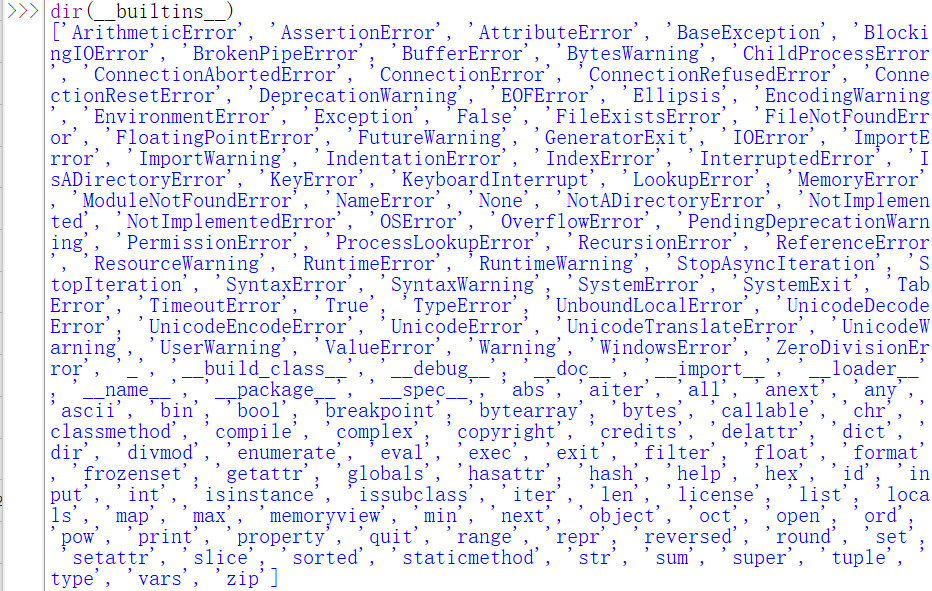
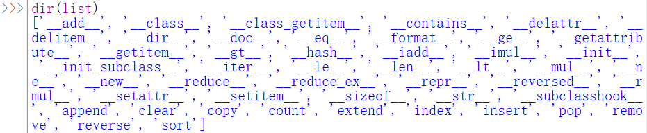

# Python

## 入门篇

### 缩进和内置函数BIF

缩进是python的灵魂

#### 内置函数BIF

在IDLE中输入dir(\__builtins__)可以看到Python提供的内置函数列表。



help()这个BIF用于显示BIF的功能描述

如help(print)

### 一些基础知识

#### 变量

python没有变量，只有名字

#### 字符串

#### 原始字符串

`string = r'C:\now'`

#### 长字符串

("""内容""")

#### 条件分支

```python
if 条件:
    条件为true执行的操作
else:
    条件为false执行的操作
```

#### while循环

```python
while 条件:
    条件为true执行的操作
```

#### 模块

引入random模块

`import random`

#### 数据类型

- 整型

- 浮点型

  E记法

- 布尔类型

- 类型转换

  int() float() str()

- type()函数来获取变量的类型

  isinstance()

#### 常用操作符

##### 算术操作符

\+    -    *    /    %    **    # 

##### 优先级

幂运算操作符比其左侧的一元操作符优先级高，比其右侧的一元操作符优先级低

-3**2 == -9

3**-2 == 0.1111111111111111

##### 比较操作符

<     <=     >     >=     ==     !=

##### 逻辑操作符

and   or   not

3 < 4 < 5 合法，被解释为 3 < 4 and 4 < 5

### 分支和循环

if else elif

python可以有效避免”悬挂else“

#### 条件表达式（三元操作符）

a = x if 条件 else y

`small = x if x<y else y`

#### 断言assert

assert 3>4 抛出异常

#### for循环

```python
stri="ALIENN"
for each in stri:
    print(each,end='')
```

range()内建函数

`range([start,]stop[,step=1])`

```py
for i in range(1，10，2):
    print(i)
```

#### break语句

#### continue语句

### 列表、元组和字符串

#### 列表

##### 列表的增删改查

```python
#创建列表
number = [1,2,3,4,5,6]
mix = [1,"小",3.24,[1,2,3]]
empty=[]

#向列表添加元素
number.append(6)	#添加元素
number.extend([7,8])#添加多个元素 它的参数是一个列表
number.insert(1,0)	#在位置1插入元素0

#从列表中获取元素，通过索引值(index)
name=["鸡蛋","鸭蛋","鹅蛋","李狗蛋"]
name[3]							#3号元素 '李狗蛋'
name[0],name[3]=name[3],name[0]	#0号元素和3号元素互换位置

#从列表中删除元素
name.remove("李狗蛋")#按元素值删除
del name[1]			#删除指定位置
del name			#删除整个列表
name.pop()		#弹出最后一个元素
name.pop(2)		#弹出2号元素
```

另外：Python 的列表 支持负数索引

##### 列表分片

列表分片是建立原列表的一个拷贝

```python
name=["鸡蛋","鸭蛋","鹅蛋","李狗蛋"]
name[0:2]	#0号到1号元素
name[:3]	#列表头到2号位置元素
name[3:]	#3号元素到列表末尾
name[:]		#全部元素

#分片操作的第三个参数
list1 = [1,2,3,4,5,6,7,8,9]
list1[0:9:2]	#2代表步长

#步长可以是负数 -1 -2 ...
list1[::-1]	#步长设置为-1，相当于复制一个反转的列表
```

##### 一些常用操作符

```python
#比较操作符
list1 = [123,456]
list2 = [234,123]
list1 < list2	#从第一个元素开始比较

#连接操作符 +
list3 = list1 + list2
#重复操作符 *
list1 * 3
list1 *= 5

#成员关系运算符 in  not in
list1=["猪","猫",["小甲鱼","姬"],"狗"]
'猫' in list1
"小甲鱼" not in list1
"小甲鱼" in list1[2]	#判断列表里边的列表，先进入一层列表

#访问列表中的列表
list1[2][0]
```

##### 列表的小伙伴们（常用方法）

`dir(list)`



除了前面的append()、extend()、insert()、pop()、remove() 

count() 计算它的参数在列表中出现的次数

index() 返回它的参数在列表中的位置

reverse() 将整个列表原地翻转

sort() 默认从小到大排序 sort(func,key,reverse)

copy()复制 

clear()清空元素变成空列表

```python
lsit1 = [1,2,1,3,4,5,6,7,8]
list1.count(1)
list1.index(1)
list1.index(1,1,9)	#后两个参数限定查找的范围
list1.reverse()
list1.sort()
list1.sort(reverse=True) #从大到小排序
str1=str2.copy()
str1.clear()
```

##### 分片的补充

```python
list1 = [1,4,2,3,5,6]
list2 = list1[:]
list3 = list1
list1.sort()
#排序之后list3会跟着改变，list3只是一个新的标签；list2不会，是真正的拷贝
```

##### 列表推导式

列表推导式（List comprehensions）也叫列表解析，灵感取自函数式编程语言 Haskell。Ta 是一个非常有用和灵活的工具，可以用来动态的创建列表，语法如：

`[有关A的表达式 for A in B]`

```python
[i*i for i in range(10)]
```

#### 元组

元组和列表最大的区别是你可以任意修改列表中的元素，插入删除元素，而对元组是不行的，元组是不可改变的

```python
#创建列表用的是中括号，创建元组大部分用的是小括号
tuple1 = (1,2,3,4,5,6,7)

#访问方式和列表一样：
tuple1[5:]

#可用以分片来复制：
tuple2 = tuple1[:]

#元组的标志性符号是,
temp1 = (1,) #如果要创建的元组只有一个元素，后面加,
temp2 = 1,

#更新和删除元组 间接操作
temp = ('小鸡','小鸭','小猪')
temp = temp[:2] + ('小甲鱼',) + temp[2:] #,和()都是必须的

tmep = temp[:2] + temp[3:]
del temp #删除整个元组
```

上述列表的方法中，元组只能使用count() index()

#### 字符串

```python
#分片也可以应用于字符串
str1="I love fishC!"
str1[:6]

#修改字符串 间接操作
str1[:6]+"插入的字符串"+str1[6:]
```

##### 各种内置方法

casefold() 将所有字符变成小写

count(sub[,start[,end]]) 查找sub子串出现的次数

find(sub[,start[,end]]) 查找sub子串出现的位置，找不到返回-1

index(sub[,start[,end]])  查找sub子串出现的位置，找不到抛出异常

join(sub) 以字符串作为分隔符，插入到sub中所有字符之间

```python
'_'.join("fishC")
' '.join(['I','lvoe','FishC'])
```

replace(old,new[,count]) 替换指定的字符串

split(sep=None,maxsplit=-1) 拆分字符串

```python
str2='_'.join("fishC")
str2.split(sep="_")
```

##### 格式化

format()方法

```python
#位置参数
"{0} love {1}.{2}".format("I","FishC","com")
#关键字参数
"{a} love {b}.{c}".format(a:"I",b:"FishC",c:"com")
#位置参数和关键字参数综合使用时，位置参数必须在关键字参数之前

'{0}{1:.2f}'.format('Pi = ', 3.1415) #在替换域中，:表示格式化符号的开始
```

格式化操作符%

%c %s %d %o %x %X %f %e %E %g %G

```python
'%c%c%c%c'%(70,105,115,104)
```

辅助指令 m.n   -   +  #   0

python的转义字符

#### 序列-常用的BIF

##### list([iterable])

##### tuple([iterable])

##### str(obj)

##### len(sub)

##### max(...)

##### min(...)

##### sum(iterable[,start])

##### sorted(iterable,key=None,reverse=False)

 #返回一个排序后的新列表

##### reversed(sequence) 

#返回逆向迭代序列的值，返回一个迭代器对象

##### enumerate(iterable) 

#生成由二元组构成的一个迭代对象

##### zip(iter1[,iter2[...]])

### 函数

#### 创建函数

```python
def myFunctionName(参数1,参数2,...):
	函数体
    return 返回值
```

#### 函数文档，关于参数

```python
def exchangeRate(dollar):
    '''函数文档
    美元->人名币
    汇率暂定6.5
    '''
    return dollar*6.5

#函数文档可以通过特殊属性__doc__获取，以及help()函数
exchangeRate.__doc__
help(exchangeRate)
```

##### 关键字参数和默认参数

```python
def saySome(name,words):
    print(name+'->'+words)
#关键字参数，避免搞乱位置参数的顺序
saySome(words="啊八八八八八八",name="埃列娜")

#默认参数
def saySome(name="小甲鱼",words="无话可说"):
    print(name+'->'+words)
```

##### 收集参数/可变参数

```python
#函数的作者也不知道需要多少个参数，参数前加*号
def test(*params):
    print("有%d个参数" % len(params))
    
#收集参数后面还需要指定其他参数，调用时需使用关键参数来指定
def test(*params,extra):
    print("收集参数是：",params)
    print("位置参数是：",extra)
test(1,2,43,4,extra='9')
#所以建议设置为默认参数
def test(*params,extra=0):
    
#*号既可以打包也可以解包：
#需要将一个列表a传入test的收集参数*params中，调用test(a)会出错，需要解包
def test(*params):
    print("有%d个参数" % len(params))
    print("第2个参数是：",params[1]) #是因为这句，没有第二个参数
a=[1,2,3,4,5,6,7]
test(*a)
```

#### 函数和过程

python严格来说只有函数，没有过程

##### 返回值

python可以动态确定函数的类型，而且函数还能返回不同类型的值。还可以同时返回多个值

```python
def test():
    return [1,'鱼',3.14]
def test():
    return (1,'鱼',3.14)
```

##### 函数变量的作用域

局部变量

全局变量

#### 内嵌函数和闭包

##### global关键字

```python
#使用global关键字在函数中修改全局变量
count=5
def Fun():
	global count
    count=10
    print(count)
```

##### 内嵌函数

python的函数定义是可以嵌套的

##### 闭包

如果在一个内部函数里，对在外部作用域（但不是在全局作用域）的变量进行引用，那么内部函数就被认为是闭包

```python
def funX(x):
    def funY(y):
        return x*y
    return funY
i=funX(8)
i(5)
#funX(8)(5)
```

nonlocal关键字（python3）

如果希望在内部函数里修改外部函数里的局部变量的值，可以使用nonlocal，使用方式跟global一样

#### lambda表达式

python允许使用lambda关键字来创建匿名函数

```python
#普通函数
def ds(x):
    return 2*x+1
#lambda语句 返回一个函数对象
g = lambda x : 2*x+1
g(5)

#普通函数 带两个参数
def add(x,y):
    return x+y
g = lambda x,y: x+y
g(3,4)
```

#### 介绍两个BIF：filter() map()

##### 1. filter()

有两个参数。第一个参数可以是函数或者None，如果是函数，将第二个可迭代数据里的每一个元素作为函数的参数进行计算，把返回True的值筛选除出来；如果第一个参数是None，将第二个参数中为True的值筛选出来

```python
#第一个参数是None
temp=filter(None,[1,0,True,False])
list(temp)

#第一个参数是函数
def odd(x):
    return x%2
temp=(odd,range(10))
list(temp)

#使用lambda表达式简化
list(filter(lambda x: x%2,range(10)))
```

##### 2. map()

映射

返回所有加工后的元素构成的新序列

```python
list(map(lambda x:x*2,range(10)))
```

#### 递归

求阶乘

斐波那契数列

汉诺塔

### 字典和集合

#### 字典

有些地方叫hash，或者关系数组

键(Key)值(Value)对 每一对键值组合称为项

```python
#创建和访问字典
dict1={"lix":"It's totally fine","猪":"是猪","小甲鱼":"让编程改变世界"}
print(dict1["小甲鱼"])

empty={} #空字典

#使用dict()来创建字典，dict()的参数可以是一个序列（但不能是多个）
dict2=dict((('F',70),('s',115),('h',104)))
dict3=dict([('F',70),('s',115),('h',104)])
dict4=dict(F=70,s=115,h=104)
dict5=dict(zip(['one','two','three'],[1,2,3]))

#直接给字典的键赋值，如果不存在，创建新的键
dict1['x']=111

```

#### 各种内置方法

字典是python中唯一的映射类型，字典不是序列

##### fromkeys() 

创建并返回一个新的字典

```python
dict1={}
dict1.fromkeys((1,2,3)) #{1: None, 2: None, 3: None}
dict2.fromkeys((1,2,3),"number") #{1: 'number', 2: 'number', 3: 'number'}
dict3.fromkeys((1,2,3),("one","two","three")) #{1: ('one', 'two', 'three'), 2: ('one', 'two', 'three'), 3: ('one', 'two', 'three')}
```

##### keys()、values()、items()

keys()返回字典中键，values()返回字典中的值，items()返回字典中的项

```python
dict1=dict.fromkeys(range(32),"赞")
dict1.keys()
dict1.values()
dict1.items()
```

##### get()

一个更宽松的方式访问字典项，当键不存在的时候，get()方法不会报错，只是返回一个None

```python
dict1.get(31) #'赞'
dict1.get(32)

#如果希望找不到数据时返回指定的值，在第二个参数设置默认返回值
dict1.get(32,"木有") #'木有'

#不知道一个键是否在字典中，可以使用成员资格运算符(in 或 not in )判断
31 in dict1 #True

#清空字典
dict1.clear()
```

##### copy()

复制字典

```python
a={1:"one",2:"two",3:"thr"}
b=a.copy()
```

##### pop()和popitem()

pop()是弹出对应的值，popitem()一个项

```python
a={1:"one",2:"two",3:"thr",4:"four"}
a.pop(2) #'two'	 此时a={1: 'one', 3: 'thr', 4: 'four'}
a.popitem() #(4, 'four')  此时a={1: 'one', 3: 'thr'}

#setdefault()方法和get()相似，但是找不到相应的键时会自动添加
a.setdefault(1)   #'one'
a.setdefault(5)   #此时a={1: 'one', 2: 'two', 3: 'thr', 4: 'four', 5: None}
```

##### update()

更新字典

```python
pets={"米奇":"老鼠","猪":"是猪","小甲鱼":"鱼"}
pets.update(小甲鱼="ok")
```

#### 收集参数的两种打包形式

一种是以元组的形式打包，另一种是以字典的形式打包

```python
def test(**params):
    print("有%d个参数" % len(params))
    print("它们分别是",params)
test(a=1,b=2,c=3) # 有3个参数 它们分别是 {'a': 1, 'b': 2, 'c': 3}

a={"one":1,"two":2,"three":3}
test(**a)
```

#### 集合

集合是无序的

```python
#创建集合
set1={1,2,3,7,5,6}     #{1, 2, 3, 5, 6, 7}
set1={"小甲鱼","小鲤鱼","小甲鱼"}
set2=set(["小甲鱼","小鲤鱼","小甲鱼","小甲鱼"])
set1==set2 #True

#访问集合 
#使用迭代把集合中的数据一个个读取出来
set1={1,2,4,3,7,5,6,2,1,0}
for each in set1:
    print(each)
#in  not in判断是否在集合中
0 in set1
#add()添加元素 remove()删除元素
set1.add('yu')
set1.remove(2)
```

不可变集合frozenset()

```python
set1=frozenset({1,2,3,4,5})
```

[**集合类型内建方法总结**](https://fishc.com.cn/thread-45276-1-1.html)

### 永久存储

#### 文件

#打开文件 open()函数
`f=open("1.txt")`

[文件的打开模式和文件对象方法](https://fishc.com.cn/thread-45279-1-1.html)

文件对象的方法

close()

read(size=-1)

readline()

write(str)

writelines(seq)

seek(offset,from)

tell()

```python
#关闭文件
f.close() #Python会自动关闭文件，不忘记了也不会造成内存泄漏

#文件读取
f.read() #按字节为单位读取，没有参数会全部读取
f.readline() #读取一整行
list(f) #文件放到列表中
f.tell() #告诉你当前文件指针的位置
f.seek(offset,from) #调整文件指针的位置，从from(0起始,1当前,2末尾)偏移offset字节 f.seek(0,0)设置到起始位置
#迭代读取文件中的每一行
for each_line in f:
    print(each_line)

#文件的写入
f=open("1.txt","w")
f.write("well,i guess")

```

#### 文件系统

OS模块中常用函数

```python
import os
os.getcwd()
```

1. getcwd() #返回当前工作目录
2. chdir(path) #改变当前工作目录
3. listdir(path='.') #列举当前目录下的文件和子目录
4. mkdir(path) #创建文件夹，若存在，则抛出异常
5. makedirs(path) #创建多层目录
6. remove(path) #删除文件、rmdir(path) #删除目录、removedirs(path) #删除多层目录
7. rename(old,new) #重命名
8. system(command) 
9. walk(top) #遍历指定路径下的所有子目录，返回一个三元组(路径,[包含目录],[包含文件])

一些os.path模块，比如

os.curdir

os.pardir

os.sep

os.linesep

10. basename(path)和dirname(path) #获取文件名和路径名

11. join(path1[,path2[,...]]) #将路径名和文件名组合成一个完整的路径

12. split(path)和splittext(path) #分割路径

13. getsize(file)

14. getatime(file)、getctime(file)、getmtime(file) #最近访问时间、创建时间、修改时间

    返回值是浮点型秒数，可用time模块的gmtime()或localtime()函数换算

    ```python
    import os
    import time
    temp=time.localtime(os.path.getatime("1.txt"))
    print(time.strftime("%d %b %Y %M %S",temp))
    ```

#### pickle：泡菜

将列表、字典数据类型存储为文件

它几乎可以把所有对象转化为二进制形式存放，这个过程称为pickling，从二进制转换回对象的过程称为unpickling

```python
##存入
import pickle
my_list=[123,3.24,'xiaojia',['anonhrt']]
f=open("1.pkl","wb")
pickle.dump(my_list,f)
f.close()

##读取
import pickle
f=open("1.pkl","rb")
my_list=pickle.load(f)
print(my_list)
```

### 异常处理

#### 异常

1. AssertionError：断言语句(assert)失败

   assert关键字后条件为假时，程序停止并抛出异常。常用于测试程序时在代码这置入检查点。

2. AttributeError：尝试访问未知的对象属性

3. IndexError：索引超出序列的范围

4. KeyError：字典中查找一个不存在的关键字

5. NameError：尝试访问一个不存在的变量

6. OSError：操作系统产生的异常

7. TypeError：不同类型间的无效操作

8. ZeroDivisionError：除数为零

[Python 标准异常总结](https://fishc.com.cn/thread-45814-1-1.html)

异常捕获用try语句

#### try-except语句

`try:
	检测范围
except Exception[ as reason]:
	出现异常(Exception)后的处理代码`

```python
try:
    f=open('我是一个文档?.txt')
    print(f.read())
    f.close()
except OSError as reason:
    print("文件打开出错"+str(reason))
    
#针对不同异常设置多个except
#一个try语句可以和多个except语句搭配
    
#对多个异常统一处理
except (TypeError,OSError) as reason:

#捕获所有异常
except:
    print("出错啦")
```

#### try-finally语句

```python
#finally是确保无论如何都将被执行的内容
try:
    f=open("1.txt")
    print(f.read())
    sum=1+'1'
    f.close()
except:
    print("Wronggggggg")
finally:
    f.close()
  
#如果文件打开失败，finally中执行文件关闭会出错，可以添加一条语句
try:
    f = open('My_File.txt') # 当前文件夹中并不存在"My_File.txt"这个文件T_T
except OSError:
    print('出错啦' )
finally:
    if 'f' in locals(): # 如果文件对象变量存在当前局部变量符号表的话，说明打开成功
        f.close()
```

#### raise语句

让我的代码自己抛出异常，还可以带参数

`raise ZeroDivisionError("除数不能为零")`

```python
try:
    for i in range(5):
        if i == 3:
            raise KeyboardInterrupt
        print(i)
except KeyboardInterrupt:
    print('退出啦！')
```

#### 丰富的else语句

python中，else不能能和if语句搭，还能跟循环语句搭，还能跟异常处理进行搭配

```python
#else和while语句搭配
def showMaxFactor(num):
    count = num //2
    while count>1:
        if num%count==0:
            print('%d最大的约数是%d' % (num,count))
            break
        count -= 1
    else:
        print("%d是素数" % num)

num=int(input("输入一个数:"))
showMaxFactor(num)

#else和异常处理搭配
try:
    int('abc')
except ValueError as reason:
    print('出错啦'+str(reason))
else:
    print('没有异常')
```

#### 简洁的with语句

对文件操作使用with语句，减少代码量，不用担心文件忘了关闭

```python
#修改try-finally语句的代码
#with会自动帮你关闭文件
try:
    with open("1.txt") as f:
        print(f.read())
except:
    print('Wronggggggggg')
    
#with 语句处理多个项目的时候，可以用逗号隔开写成一条语句
with A() as a, B() as b:
    suite
```

### 类和对象

#### 对象=属性+方法

```python
#定义类
class Turtle:
    color='green'
    weight=10
    legs=4
    def climb(slef):
        print("爪巴")
    def eat(self):
        print('I;m eating')
        
#创建对象
tt = Turtle()
```

在python中，约定类名用大写字母开头，函数用小写字母开头

##### self类似于C++的this指针

```python
class Ball:
    def setName(self,name):
        self.name=name
    def kick(self):
        print("我是%s" % self.name)
```

##### 魔法方法-构造方法\__init()__

类似于C++的构造函数

```python
#重写__init()__方法来自定义对象的初始化操作
class Potato:
    def __init__(self,name):
        self.name=name
    def kick(self):
        print("我是%s" % self.name)

p=Potato("土豆")
p.kick()
```

##### 共有和私有

python默认的属性和方法是共有的，可以直接通过点操作符(.)进行访问

name mangling（名字改编）：在变量名或函数名前面加上__，这个函数或变量就是私有了

```python
class Person:
    __name="小甲鱼"
	def getName(self):#需要从内部访问
        return self.__name
```

实际上python只是把变量改名而已，用"_类名__变量名"即可访问 `p._Person__name`

python的私有机制其实是伪私有。python的类是没有权限控制的，所有变量都可以被外部调用

#### 继承

```python
class 类名(被继承的类):
    ...
    
#也可以使用__bases__属性
C.__bases__ += (A, B, )
```

##### 解决子类的init()覆盖父类

```python
#调用未绑定的父类对象
class Son(Base):
    def __init__(self):
        Base.__init__(self)
        self.shuxing=shuxing

#使用super函数，会自动帮你找到基类是方法
class Son(Base):
    def __init__(self):
        super(). __init__()
        self.shuxing=shuxing
```

##### 多重继承

```python
class 类名(父类1,父类2,父类3,...):
    ...
    
#也可以使用__bases__属性
C.__bases__ += (A, B, )
```

##### 组合

一个类的对象可以作为另一个类的属性

```python
class Fish:
    def __init__(self,x):
        self.num=x
class Pool:
    def __init__(self,x):
        self.fish=Fish(x)
```

##### 类、类对象、实例对象  绑定

#### 一些BIF

1. issubclass(class,classinfo)

2. isinstance(object,classinfo)

3. hasattr(object,name)

4. getattr(object,name[,default])

5. setattr(object,name,value)

6. delattr(object,name)

7. property(fget=None,fset=None,fdel=Nonemdoc=None)

   [property 的详细使用方法](https://fishc.com.cn/thread-51106-1-1.html)

扩展：Python 也有内置的修饰符，它们分别是 staticmethod、classmethod 和 property，作用分别是把类中定义的实例方法变成静态方法、类方法和类属性。

[Python 函数修饰符（装饰器）的使用](https://fishc.com.cn/thread-51109-1-1.html)

### 魔法方法（略）

#### 构造和析构

##### \__init__(self[,...])

\__init__()相当于其他语言的构造方法，只能返回None。

##### \__new__(cls[,...])

\_\_new\__()才是对象实例化的时候调用的第一个方法，第一个参数不是self而是这个类(cls)，而其他的参数会直接传递给 _\_init__()方法。

\__new__()方法需要返回一个实例对象，通常是cls这个类实例化的对象，也可以返回其他对象。

```python
#当继承一个不可变的类型时
class CapStr(str):
    def __new__(cls,string):
        string=string.upper()
        return str.__new__(cls,string)
```

##### \__del__(self)

析构容器

#### 算术运算

工厂函数：普通的BIF是<class 'builtin_function_or_method'>，而工厂函数是<class 'type'> ，其实就是一个类对象。

##### 算术操作符

| **运算符**  | **对应的魔法方法**            |
| ----------- | ----------------------------- |
| +           | \__add__(self,other)          |
| -           | \__sub__(self,other)          |
| *           | \__mul__(self,other)          |
| /           | \__truediv__(self,other)      |
| //          | \__floordiv__(self,other)     |
| %           | \__mod__(self,other)          |
| divmod(a,b) | \__divmod__(self,other)       |
| **          | \__pow__(self,other[,modulo]) |
| <<          | \__lshift__(self,other)       |
| >>          | \__rshift__(self,other)       |
| &           | \__and__(self,other)          |
| ^           | \__xor__(self,other)          |
| \|          | \__or__(self,other)           |

```python
class New_int(int):
    def __add__(self,other):
        return int.__add__(self,other)
    def __sub__(self,other):
        return int(self)-int(other)
    
a=New_int(5)
b=New_int(4)
a+b
a-b
```

扩展：[鸭子类型（duck typing）](https://fishc.com.cn/thread-51471-1-1.html)

##### 反运算

\__radd__(self,other)

##### 增量赋值运算

a+=b

##### 一元操作符

`__neg__()`

`__pos__()`

`__abs__()` 绝对值

`__invert__()` 按位取反

#### 简单定制（略）

#### 属性访问

属性相关的魔法方法

\__getattr__(self,name)

\__getattribute__(self,name)

\__setattr__(self,name,value)

\__delattr__(self,name)

特殊属性 \__dict__

#### 描述符(property的原理)


#### 定制序列


#### 迭代器


#### 生成器


### 模块

#### 模块就是程序

#### 命名空间

#### 导入模块

1. import模块名
2. from 模块名 import 函数名
3. import 模块名 as 新名字

#### ______name______='______main__'

```python
#确保模块只有作为程序运行时才执行测试代码
if __name__=='__main__':
    test()
```

#### 搜索路径

```python
import sys
sys.path #python在导入模块时会搜索的路径
'''['D:\\0000\\py', 'D:\\Python\\Python310\\Lib\\idlelib', 'D:\\Python\\Python310\\python310.zip', 'D:\\Python\\Python310\\DLLs', 'D:\\Python\\Python310\\lib', 'D:\\Python\\Python310', 'D:\\Python\\Python310\\lib\\site-packages']'''
#site-packages是最佳选择

#添加新的搜索路径
sys.path.append("D:\\0000")
```

#### 包

文件夹里存放相关的模块，文件夹的名字就是包的名字。
创建一个\__init__.py的模块文件，内容可以为空

包名.模块名

