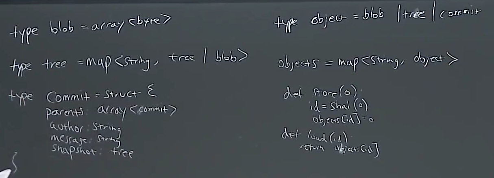

# missing

https://missing.csail.mit.edu/

https://missing-semester-cn.github.io/


## 1 The Shell

最简单的重定向是 `< file` 和 `> file`。

您还可以使用 `>>` 来向一个文件追加内容。使用管道（ *pipes* ），我们能够更好的利用文件重定向。 `|` 操作符允许我们将一个程序的输出和另外一个程序的输入连接起来。


**curl命令 grep命令 cut命令**

```shell
curl --head --silent google.com | grep --ignore-case content-length | cut --delimiter=' ' -f2
```

**tee命令**

https://missing-semester-cn.github.io/2020/course-shell/

```shell
echo 3 | sudo tee brightness
```


## 2 Shell 工具和脚本

### Shell 脚本

**""**和 **''**

```shell
#以'定义的字符串为原义字符串，其中的变量不会被转义，而"定义的字符串会将变量值进行替换。
foo=asd 
echo "value is $foo" #""里的会被展开为字符串
echo 'Value is $foo' #''里的不会展开
```


**Special Characters**
与其他脚本语言不同的是，bash使用了很多特殊的变量来表示参数、错误代码和相关变量。下面是列举来其中一些变量，更完整的列表可以参考 [这里](https://www.tldp.org/LDP/abs/html/special-chars.html)。

- `$0` - 脚本名
- `$1` 到 `$9` - 脚本的参数。 `$1` 是第一个参数，依此类推。
- `$@` - 所有参数
- `$#` - 参数个数
- `$?` - 前一个命令的返回值
- `$$` - 当前脚本的进程识别码
- `!!` - 完整的上一条命令，包括参数。常见应用：当你因为权限不足执行命令失败时，可以使用 `sudo !!`再尝试一次。
- `$_` - 上一条命令的最后一个参数。如果你正在使用的是交互式 shell，你可以通过按下 `Esc` 之后键入 . 来获取这个值。

退出码可以搭配 `&&`（与操作符）和 `||`（或操作符）使用，用来进行条件判断，决定是否执行其他程序。它们都属于短路[运算符](https://en.wikipedia.org/wiki/Short-circuit_evaluation)（short-circuiting） 同一行的多个命令可以用` ; `分隔。程序 `true` 的返回码永远是`0`，`false` 的返回码永远是`1`。


**命令替换**（*command substitution*）
当您通过 `$( CMD )` 这样的方式来执行`CMD` 这个命令时，它的输出结果会替换掉 `$( CMD )` 。

```shell
echo "We are in $(pwd)"

#一个冷门的类似特性
#进程替换（process substitution）
#<( CMD ) 会执行 CMD 并将结果输出到一个临时文件中，并将 <( CMD ) 替换成临时文件名。
cat <(ls) <(ls ..)
```


**比较操作** 
[`test 手册`](https://man7.org/linux/man-pages/man1/test.1.html)。 在bash中进行比较时，尽量使用双方括号 `[[ ]]` 而不是单方括号 `[ ]`，这样会降低犯错的几率，尽管这样并不能兼容 `sh`。 更详细的说明参见[这里](http://mywiki.wooledge.org/BashFAQ/031)。


 **通配**（*globbing*）

- 通配符 - 当你想要利用通配符进行匹配时，你可以分别使用 `?` 和 `*` 来匹配一个或任意个字符。例如，对于文件`foo`, `foo1`, `foo2`, `foo10` 和 `bar`, `rm foo?`这条命令会删除`foo1` 和 `foo2` ，而`rm foo*` 则会删除除了`bar`之外的所有文件。
- 花括号`{}` - 当你有一系列的指令，其中包含一段公共子串时，可以用花括号来自动展开这些命令。这在批量移动或转换文件时非常方便


编写 `bash` 脚本有时候会很别扭和反直觉。例如 [shellcheck](https://github.com/koalaman/shellcheck) 这样的工具可以帮助你定位sh/bash脚本中的错误。

### Shell 工具

**查看命令如何使用**

man tldr
[TLDR pages](https://tldr.sh/) 

**查找文件**

find fd
locate （通过updatedb来更新数据库）

**查找代码/文件内容**

grep ripgrep(rp)  还有ack ag等

`-C` ：获取查找结果的上下文（Context）；`-v` 将对结果进行反选（Invert）
`-u` ：不忽略隐藏文件； `--stats` : 打印匹配的统计信息（匹配的行和文件的数量）

**查找 shell 命令**

history
^R 

zsh fzf通用对模糊查找工具
fish 
*fish和zsh也是一种shell，支持基于历史的自动补全

```shell
cat example.sh | fzf
```

**文件夹导航**

autojump

tree broot


## 3 vim

https://missing-semester-cn.github.io/2020/editors/

- **正常模式**：在文件中四处移动光标进行修改
- **插入模式**：插入文本
- **替换模式**：替换文本
- **可视化模式**（一般，行，块）：选中文本块
- **命令行模式**：用于执行命令


## 4 Data Wrangling


## 6 Git

[版本控制(Git)](https://missing-semester-cn.github.io/2020/version-control/)

git是基于有向无环图实现的

文件夹：tree	文件：blob



### 常用命令

```shell
mkdir demo	
git init	#初始化空的git仓库，此时产生隐藏文件夹.git
ls .git		#.git中的objects和refs文件夹，对象和引用
git help	#
git status	#查看仓库状况
echo "hello" > hello.txt
git add hello.txt	#staging area暂存区，告诉git下一次snapshot中有哪些
git commit	#创建快照(snapshot)
git log		#visualize the history
git cat-file -p 42fb7a2	#hash值
git log --all --graph --decorate	#图表示，显示所有
git log --all --graph --decorate --oneline
git checkout 42fb7a2	#改变working directory
git checkout master

git diff 	#显示what changed since the last snapshot
git diff 42fb7a2 hello.txt	#since 42fb7a2 to hello.txt 
git diff hello.txt			#since HEAD to hello.txt
git diff 42fb7a2 HEAD hello.txt	#from 42fb7a2 to HEAD in hello.txt

git checkout hello.txt	#回到HEAD指向的snapshot
vim animal.py	#写一个简单程序
git add git commit

git branch -vv
git branch cat #创建cat分支
vim animal.py	git add git commit
git checkout -b dog	#创建dog分支并切换到dog分支
vim animal.py	git add git commit
git checkout master
git merge cat
git merge dog	#出现冲突
#git merge cat dog
git mergetool	#解决冲突的工具
git merge --abort	#回到冲突之前
#手动解决冲突，修改代码
git merge dog	#出现冲突
git merge --continue

git remote	#列出远程主机
cd .. && mkdir remote && cd remote	#创建另一个文件夹当作remote仓库
git init --bare	#remote仓库
#回到demo文件夹
cd ../demo
>git remote add <name> <url>	#添加远程仓库
git remote add origin ../remote
>git push <remote> <local branch>:<remote branch>#同步到远程仓库
git push origin master:master

#demo2模拟Machine2
cd ..
git clone ./remote demo2
cd demo2
git log --all --graph --decorate --oneline	#只有到origin分支
#此时machine1更改，machine2并不会看到
cd ../demo
vi animal.py	git add git commit
#demo2	git log 是修改前
#machine1上传
#git push origin master:master 可以，但是太繁琐
git branch --set-upstram-to-origin/master
git branch -vv
git push
#remote已更改，切换到machine2
cd ../demo2
>git fetch <remote>
git fetch	#只有一个remote，默认直接使用
git pull	# = git fetch; git merge

git clone	#初始化
```

### 高级操作

```shell
#other
git config		#配置文件
vi ~/.gitconfig

git clone --shallow	#latest snapshot

vi animal.py
git diff
git add -p animal.py #s
git diff --cached
git diff	
git commit

git blame	#who edit

git stash	#返回上一次更改
git stash pop

git bisect	#
```

git ignore文件

```shell
vi .gitignore 
```

### 杂项

- git图形化客户端

- shell集成([zsh](https://github.com/olivierverdier/zsh-git-prompt), [bash](https://github.com/magicmonty/bash-git-prompt))。[Oh My Zsh](https://github.com/ohmyzsh/ohmyzsh)这样的框架中一般以及集成了这一功能

- 编辑器集成。[fugitive.vim](https://github.com/tpope/vim-fugitive) 是 Vim 中集成 GIt 的常用插件

资源：[Pro Git](https://git-scm.com/book/en/v2)


## 7

