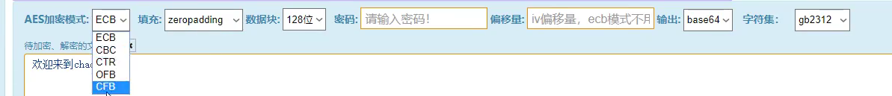

# 渗透测试

## 渗透基础入门

### 概念名词

#### 域名

- 子域名

- 二级域名

- 多级域名

#### DNS与CDN

- DNS使用TCP和UDP端口53

- 本地HOSTS

- CDN是Content Delivery Network，即内容分发网络

- DNS攻击：域名劫持、DNS DDoS攻击、反射式DNS放大攻击

#### 脚本语言

asp php aspx jsp javaweb pl py cgi等

#### 后门

后门程序一般是指那些绕过安全性控制而获取对程序或系统访问权的程序方法。类别：网页、线程插入、扩展、C/S后门

#### WEB

WEB的组成架构模型？

- 网站源码：分脚本类型，分应用方向

- 操作系统：windows linux

- 中间件（搭建平台）：apache iis tomcat nginx等

- 数据库：access mysql mssql oracle sybase db2 postsql等

WEB相关安全漏洞

- WEB源码类对应漏洞

  SQL注入，上传，XSS，代码执行，变量覆盖，逻辑漏洞，反序列化等

- WEB中间件对应漏洞

- WEB数据库对应漏洞

- WEB系统层对应漏洞

### 数据包扩展

#### 了解网站搭建过程

涉及到的攻击层面？（源码，搭建平台，系统，网络层等）

涉及到的安全问题？（目录，敏感文件，弱口令，IP及域名等）

#### HTTP/HTTPS数据包

- Request请求数据包

- Response返回数据包

#### Request请求数据包格式

1. 请求行：请求方法、请求URL和HTTP版本

   HTTP 规划定义了8种可能的请求方法：

     GET  HEAD  POST  PUT  OPTIONS TRACE  CONNECT 

2. 请求头：由关键字/值对组成，每行一对，关键字和值用冒号分享。请求头标通知服务器腾于客户端的功能和标识。

   HOST: 

   Accept：

   User-Agent：

   Host：

   Accept-Langeuage：

   connection：

   Cookie：

   Referer：

   Content-Type：

   Accept-Charset：

   Accept-Encoding：

3. 空行：请求头与请求体之间用一个空行隔开；

4. 请求体：使用POST传送，最常使用的是 Content-Type 和 Content-Length 头标。

#### Response返回数据包格式

1. 状态行：协议版本、数字形式的状态代码和状态描述，元素之间以空格分隔

2. 响应头标：包含服务器类型、日期、长度、内容类型等

3. 空行：响应头与响应体之间用空行隔开

4. 响应数据：浏览器会将实体内容中的数据取出来，生成相应的页面

- HTTP响应码：

  1xx：信息，请求收到，继续处理

  2xx：成功，行为被成功地接受、理解和采纳

  3xx：重定向，为了完成请求，必须进一步执行的动作

  4xx：客户端错误

  5xx：服务器错误

  200 存在文件

  403 存在文件夹

  3xx 均可能存在

  404 不存在文件及文件夹

  500 均可能存在

### 搭建安全扩展（中间件）

✧ 常见搭建平台脚本启用

✧ 域名IP目录解析安全问题

✧ 常见文件后缀解析对应安全

✧ 常见安全测试中的安全防护

​	身份验证  IP地址限制

✧ WEB后门与用户及文件权限

### WEB源码扩展


### 系统与数据库


### 加密编码算法

常见加密编码算法

MD5 SHA ASC 进制 时间戳 URL BASE64 Unescape AES DES

MD5 长度固定 32位，不可逆 

URL会转义为%

base64会出现==    比如1编码后为MQ==

Unescape 会出现%

AES会出现/

DES会出现+

AES加密的各种参数：



## 信息搜集

### CDN绕过

常见技术：

子域名查询

邮件服务查询

国外地址请求

遗留文件，扫描全网

黑暗引擎搜索特定文件

dns历史记录，以量打量

### 架构，搭建，WAF等


旁注：同服务器不同站点

C段：同网段不同服务器不同站点

### ※APP和其他资产

APP

思路1：涉及WEB

思路2：尝试提取 反编译

这节课思路很清晰，多做参考

### 资产监控拓展

Github监控 一个脚本

域名搜集途径

黑暗引擎

## WEB漏洞


重点是右边的内容

### sql注入


#### MYSQL

```mysql
1.单行注释“--”,语法“-- 注释内容”;
2.单行注释“#”, 语法“#注释内容”;
3.多行注释“/**/”,语法“/*注释内容 */”;
4.内联注释“/*! */”,语法“/*!注释内容 */”。
```

> 信息搜集：（mysql为例）

> 数据库版本：version()
>
> 数据库名字：database()
>
> 数据库用户：user()
>
> 操作系统：@@version_compile_os

判断注入: 老方法：id =1 and 1=1 ；思维灵活一点：可以用id=sdasd随便输 来判断

猜解列名数量（字段数）： order by x 错误与正常的临界值

猜解准备：联合查询 id =-1 union select 1,2,3,4 （让前面语句报错，union后面就会执行）

可以猜解出数据库版本、数据库名字、数据库用户、操作系统

发现是高版本5.7 ，查询指定数据库下的表名信息 

```mysql
-- 使用到的mysql语句
order by x
union
group_concat
```

知识点：
1.在MYSQL5.0以上版本中，mysql存在一个自带数据库名为information_schema,它是一个存储记录有所有数据库名，表名，列名的数据库，也相当于可以通过查询它获取指定数据库下面的表名或列名息。
2.数据库中符号"."代表下一级，如xiao.user表示xiao数据库下的user表名。

information_schema.schemata:记录所有数据库名信息的表
information_schema.tables：记录所有表名信息的表
information_schema.columns：记录所有列名信息的表

schema_name：数据库
table_name：表名
column_name：列名

- 跨库攻击演示

#### 类型及提交注入

参数类型：字符，数字，搜索，JSON等

```mysql
-- mysql的通配符%
select * from user where name=('xiaodi and 1=1')
select * from user where name like '%xiaodi%'
```

请求方法：GET,POST等     COOKIE,REQUEST,HTTP 头

REQUEST全部接受 提供绕过   COOKIE也可以提供绕过

其中 SQL 语句干扰符号：',",%,),}等，具体需看写法

$_SERVER 

#### Oracle、mongoDB等

**注入思路**：判断数据库类型、提交方法、参数类型、可能的查询方式


Access,mssql,mongoDB,postgresql,sqlite,oracle,sybase等

了解各种数据库的注入特点。比如Access是单个数据库，没有跨库操作，不支持文件操作。其他数据库基本和mysql差不多。

Q：扫描决定网站注入点用户权限？连接数据库的文件

熟悉工具的支持库，注入模式，优缺点。

#### 查询方式及报错盲注

```mysql
select 查询数据
在网站应用中进行数据显示查询操作
例：select*from news where id=$id

insert 插入数据
在网站应用中进行用户注册添加等操作
insert into news (id,url,text)values (2,'x','st')

delete 删除数据
后台管理里面删除文章删除用户等操作
例：delete from news where id=$id

update更新数据
会员或后台中心数据同步或缓存等操作
update user set pwd='$p'where id=2 and username='admin'

order by排序数据
一般结合表名或列名进行数据排序操作
select * from news order by $id 
select id,name,price from news order by $order
```

- 基于布尔的SQL盲注-逻辑判断
  regexp,like,ascii,left,ord,mid
- 基于时间的SQL盲注-延时判断
  if,sleep
- 基于报错的SQL盲注-报错回显
  floor,updatexml,extractvalue

参考：
like 'ro%' 					#判断ro或ro…是否成立
regexp 'xiaodi[a-z]' 	#匹配xiaodi及xiaodi..等
if(条件，5,0)				 #条件成立返回5反之返回0
sleep(5) 				# sQL语句延时执行5秒
mid(a,b,c) 			#从位置b开始，截取a字符串的c位
substr(a,b,c) 		#从b位置开始，截取字符串a的c长度
left(database(),1) 	#left(a,b) 从左侧截取a的前b位
length(database(0))=8		 #判断数据库database(0名的长度
ord=ascii ascii(x)=97			#判断x的asci码是否等于97

#### 二次，加解密，DNS等

常见base64编码

二次需要源码，白盒

DNSLog:解决了盲注不能回显数据，效率低的问题

补充：中转，自己编写代码，用sqlmap跑

#### 堆叠和WAF绕过

堆叠查询注入：多条sql语句一起执行。缺点是支持的数据库少


安全狗、阿里云盾、宝塔

安全狗：简单

- 更改提交方式

- 加注释符/**/ 编码 特殊符号

  %23是#		%0a是换行		%20是空格

  参数污染 ?id=1&id=-1        /*! */		/** */

- 白名单

#### sqlmap绕过

#自己写的脚本 rdog.py
python sqlmap.py -u "http://39.96.44.170/sqlilabs/Less-2/?id=1" --tamper=rdog.py
报错，抓包后发现http头包含sqlmap，而安全狗开启了工具拦截 添加参数--random-agent即可

实战下监测流量sqlmap会被拦截 解决方法：爬虫/代理/延时注入

对于sqlmap不支持修改的请求头：自定义数据包格式-r/中转脚本（课堂演示的py爬虫脚本user-agent，php也可以、之前演示过）
sqlmap去注入本地的脚本地址 -> 本地搭建脚本（请求数据包自定义编写）-> 远程地址
[PHP发送HTTP请求的6种方法](https://www.cnblogs.com/keta/p/9469417.html)

### 文件上传


#### 基础及过滤方式

常规文件上传地址的获取：扫目录，搜vip、upload.php等

upload靶场Pass-01：前端源码拷贝到本地，改源码，删掉js的过滤源码 添加action= 
或者bp抓包、禁用js

#### 黑白名单绕过

文件上传常见验证：后缀名，类型，文件头等
后缀名：黑名单、白名单
文件类型：MIME信息
文件头：内容头信息

什么是MIME信息？
上传jpg文件，抓包后：
Content-Disposition: form-data; name="upload_file"; filename="05.jpg"
Content-Type: image/jpg
而上传jsp文件：Content-Type: application/octet-stream

upload靶场Pass-02：修改Content-Type来伪造
Pass-03：黑名单，可以用后缀php5
Pass-04：.htaccess
Pass-05：大小写（新版第6关）
Pass-06：文件名后面加空格（新版第7关）
Pass-07：文件名后面加.（新版第8关）
Pass-08：文件名后面加::$DATA（新版第9关）
以上都是基于黑名单绕过

代码将字符串里的php替换为空
一次过滤
a.php a.
a.pphphp a.php
循环过滤/递归过滤
a.pphphp a.

Pass-12开始是白名单

%00 截断（get会自动解码 post不会解码，所以要解码后发送‰）

#### 内容逻辑数组绕过

Pass-13~16：上传图片，结合文件包含漏洞；不同的函数检查图片（新版第14~17关）

Pass-17：二次渲染，一般有缩略图、放大图这种，比如phpcms

Pass-19：可修改后缀为.php/.（新版第20关）

Pass-20：upload-20.php/.jpg（新版第21关）
数组 save_name[0]='upload-20.php/'	save_name[1]='.'	save_name[2]='jpg'

中间件解祈漏洞+配合文件上传测试（IIS演示）

**文件上传思路**：有无二次渲染、猜源码、中间件有无漏洞

#### 解析漏洞 编辑器安全

Apache解析漏洞-低版本：上传不识别的文件后缀
Apache换行解析
ngnix解析漏洞
ngnix文件名逻辑

编辑器 fckeditor、ueditor等

CMS OA系统

**文件上传思路**：首先找上传点（字典扫描、会员中心），试着验证/绕过，看中间件、CMS、编辑器、CVE有无漏洞

#### WAF绕过及安全修复

#上传参数名解析：明确哪些东西能修改？
Content-Disposition:一般可更改
name:表单参数值，不能更改
filename:文件名，可以更改
Content-Type:文件MIME,视情况更改

#常见绕过方法：
数据溢出-防匹配（xxx...）
符号变异-防匹配（'  " ;)
数据截断-防匹配（%00；换行）
重复数据-防匹配（参数多次）

Fuzz模糊测试

#文件上传安全修复方案
后端验证：采用服务端验证模式
后缀检测：基于黑名单，白名单过滤
MIME检测：基于上传自带类型检测
内容检测：文件头，完整性检测
自带函数过滤：参考uploadlabs函数
自定义函数过滤：function check_file(){}
WAF防护产品：宝塔，云盾，安全公司产品等

### XSS（跳过，JS之后再来）

#### 原理分类及攻击方法

分类：反射，存储，DOM
一个是后端语言进行数据处理
dom型属于用js代码进行处理

#cookie session
用户凭据：通过凭据可以判断对方身份信息
cookie 存储本地 存活时间较长 小中型
session 会话 存储服务器 存活时间较短 大型

#### 订单及Shell箱子反杀记

document.cookie

### CSRF及SSRF

#### CSRF（鸡肋）

Cross Site Request Forgery 跨站请求伪造

一般是有添加、更新、修改等功能的

防御：添加Token（最有效的一种）、检测Referer（可以绕过）

#### SSRF

各个协议调用探针：http,file,dict,ftp,gopher等
漏洞攻击：端口扫描，指纹识别，漏洞利用，内网探针等

演示：HFS的远程命令执行漏洞（RCE）

怎么寻找：


### RCE 代码及命令执行漏洞

**漏洞形成条件**：可控变量，漏洞函数。漏洞的类型由函数决定，上传-上传漏洞；执行代码-执行漏洞；输出-xss；数据库查询-注入。漏洞是否存在由可控变量决定。

**代码执行**

php：eval()、assert()、call_user_func()、call_user_func_array()、array_map()

**命令执行**

php：system()、exec()、shell_exec()、passthru()、pcntl_exec()、反引号``
管道符|

一句话Webshell后门

```php
<?php
 @eval($_POST['x']);
?>
```

### 文件操作

1. 文件被解析，则是文件包含漏洞
2. 显示源代码，则是文件读取漏洞
3. 提示文件下载，则是文件下载漏洞

#### 文件包含漏洞

包含函数如include(filename);

本地包含：无限制，有限制 %00截断 长度截断
远程包含：有限制，无限制  

[php伪协议](https://www.cnblogs.com/endust/p/11804767.html)

#### 文件下载读取

#文件名，参数值，目录符号
read.xxx?filename=
down.xxx?filename=
readfile.xxx?file=
downfile.xxx?file=
../ ..\ ./ .\等
%00 ? %23 %20 .等
&readpath=、&filepath=、&path=、&inputfile=、&url=、&data=、&readfile=、&menu=、META-lNF=、WEB-INF/web.xml

真实环境：有些学校网站下载课表，有文件下载漏洞

### 逻辑越权(SRC比较多)

#### 水平垂直越权，未授权

#水平，垂直越权，未授权访问
垂直越权：使用低权限身份的账号，发送高权限账号才能有的请求，获得其高权限的操作。
前提条件：获取的添加用户的数据包
怎么来的数据包：
1.普通用户前端有操作界面可以抓取数据包
2.通过网站源码本地搭建自己去模拟抓取
3.盲猜

#### 登录脆弱及支付篡改

#登录应用功能点安全问题
1.登录点暴力破解
2.HTTP/HTTPS传输
3.Cookie脆弱点验证（黑盒情况下非常难，抓数据包尝试修改cookie）
4.Session固定点测试
5.验证密文比对安全测试

#数据篡改安全问题
[挖洞技巧：支付漏洞之总结](https://www.secpulse.com/archives/67080.html)

#### 找回机制及接口安全

#找回重置机制
客户端回显，Response状态值，验证码爆破，找回流程绕过等

#接口调用乱用
短信轰炸，来电轰炸等

#### 验证码 Token 接口


#验证码安全
分类：图片，手机或邮箱，语音，视频，操作等
原理：验证生成或验证过程中的逻辑问题
危害：账户权限泄漏，短信轰炸，遍历，任意用户操作等
漏洞：客户端回显（已讲），验证码复用，验证码爆破（已讲），绕过等

#token安全
基本上述同理，主要是验证中可存在绕过可继续后续测试
token爆破，token客户端回显等

#验证码识别插件工具使用
captcha-killer,Pkav_Http_Fuzz,reCAPTCHA等

### 反序列化（推迟）

#### php

serialize() 序列化：将对象转化成字符串
unserialize()

#### java

位置：Java.io.ObjectOutputStream	java.io.ObjectlnputStream
**序列化：**ObjectOutputStream类->writeObject()
	注：该方法对参数指定的obj对象进行序列化，把字节序列写到一个目标输出流中
			按Java的标准约定是给文件一个.ser扩展名
**反序列化：**ObjectInputStream类->readObject()
	注：该方法从一个源输入流中读取字节序列，再把它们反序列化为一个对象，并将其返回。

标志参考：一段数据以rO0AB开头，基本可以确定是JAVA序列化base64加密的数据。或者如果以aced开头，就是这一段java序列化的16进制。

### XXE

xml是一种传输和存储的格式，XXE漏洞XML External Entity Injection，即Xml外部实体注入漏洞。

有回显：协议
无回显：引入外部实体dtd，读取文件


## JAVA安全

### JWT安全及预编译CASE注入等


### 目录遍历访问控制XSS等


## 漏洞发现

### 操作系统

相关名词：CVSS,CVE,EXP,POC

探针（漏扫工具）：Nmap，Nessus，Goby，Openvas，Nexpose	

如何利用：框架工具metasploit、searchsploit/单点exp

### WEB应用

已知CMS：dedecms.discuz,wordpress等；利用公开漏洞/扫描工具/白盒代码审计

开发框架：thinkphp、spring、flask等；利用公开漏洞/白盒代码审计

未知CMS：内部，或者CMS二次开发；是二次开发按cms思路，不是就常规 人工/工具

### APP应用


### API接口服务


## WAF绕过

